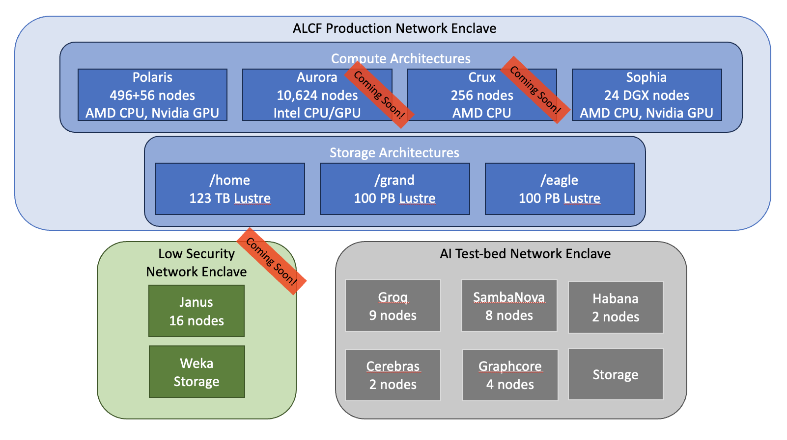
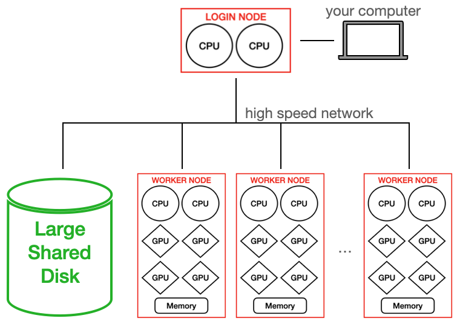

# ALCF Beginners Guide

If you are new to using supercomputers and/or ALCF systems, this is the starting place for you. This guide will teach you the following:
* how to login to ALCF systems
* how to setup a usable environment on a login node
* how to query the job scheduler
* how to submit an interactive job to execute examples on a worker node
* how to submit a job script to the scheduler

We have versions of these steps laid out for each of our systems so please pick the system you wish to begin with and start there:

* [Polaris](polaris/)
* [Crux](crux/) [Coming Soon]
* [Sophia](sophia/) [Coming Soon]

# Our Assumptions

These guides presume the reader knows:
* how to use GitHub and git repositories.
* how to use SSH on their computer in order to remotely login to another machine. If you are not familiar with SSH please search for "how to use ssh on _linux or windows or mac_".
* how to navigate a linux terminal and shell environment. Your default login shell (BASH, ZSH, etc.) can be selected via [ALCF Accounts Page](accounts.alcf.anl.gov).
* how to compile software in a linux environment using `gcc`/`g++`/`clang++`.

# ALCF Systems Overview

# What is a Supercomputer?

Argonne hosts DOE supercomputers for use by research scientists in need of large computational resources. Supercomputers are composed of many computing _nodes_ (1 _node_ = 1 physical computer) that are connected by a high-speed communications network so that groups of nodes can share information quickly, effectively operating together as a larger computer.

# A Compute Node

If you look inside your Desktop or Laptop you'll find these parts:

A computing node of a supercomputer is very similar, each has simliar parts, but it is designed as a single unit that can be inserted and removed from large closet-sized racks with many others:

In large supercomputers multiple computer processors (CPUs) and/or graphics processors (GPUs) are combined into a single node. It has a CPU on which the local operating system runs. It has local memory for running software. It may have GPUs for doing intensive calculations. Each node has a high-speed network connection that allows it to communicate with other nodes and to a large shared filesystem.

# Cluster/HPC Computing Hardware Setup

Large computer systems typically have _worker_ nodes and _login_ nodes. _login_ nodes are the nodes on which every user arrives when they login to the system. _login_ nodes should not be used for computation, but for compiling code, writing/editing code, and launching _jobs_ on the system. A _job_ is the application that will be launched on the _worker_ nodes of the supercomputer.

# Supercomputers are Big!

These supercomputers occupy a lot of space in the ACLF data center. Here is our staff at the time (2019) in front of [Mira](https://en.wikipedia.org/wiki/Mira_(supercomputer)), an IBM supercomputer, that debuted as the third fastest supercomputer in the world in 2012.

