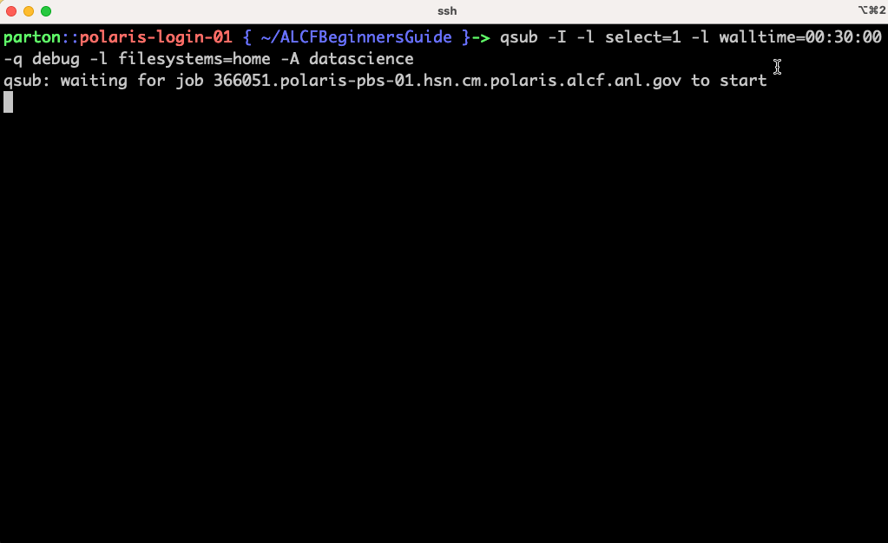
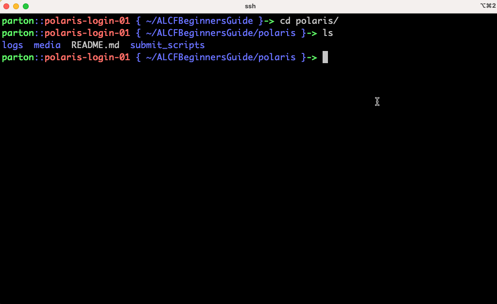
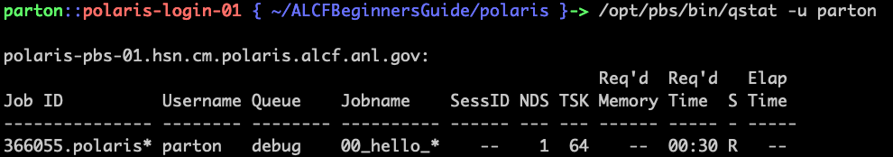

# Using the Polaris Job Scheduler: PBS

Polaris is the first machine at ALCF to use the PBS scheduler. Here is our documentation for [PBS on Polaris](https://docs.alcf.anl.gov/running-jobs/job-and-queue-scheduling/). PBS is a third party product that comes with [extensive documentation](https://help.altair.com/2022.1.0/PBS%20Professional/PBSUserGuide2022.1.pdf). This is an introduction, not an extensive tutorial so we will only cover some basics.

### User is assumed to know:
* schedulers are used to execute tasks on a cluster/supercomputer
* a job defines how to run a program/task
* a job defines how many compute nodes are needed and for how long
### Learning Goals:
* Run an interactive job
* Submit a job
* Monitoring a job
* Remove a job

## What is a scheduler

A _scheduler_ is used to fairly run applications on a large number of computers that are shared by many users. The user installs their software and data in a space accessible by the worker nodes, then creates a script (BASH or otherwise) that goes through the motions of running the application. Based on the user's needs, they submit a _job_ to the _scheduler_ that defines the number of compute nodes needed and the length of time the job should run for, also called _wall-time_. Given this information, the schduler pieces together all jobs in an efficient and fair way to run them all.

## Running interactively

When you login to the supercomputer, you are given a shell running on one of the few _login nodes_. These are shared with every other user logged into the system at that time, so they are not meant for running compute intensive things. If you would like to build software or make test runs on an actual _worker_ node, please start an interactive session in the following way:

```bash
qsub -I -l select=1 -l walltime=00:30:00 -q debug -l filesystems=home -A <project-name>
```

Here are the command breakdown:
* `qsub` is the command to submit jobs to the scheduler
* `-I` means submit an _interactive_ job
* `-l select=1` means we want one compute node for this job
* `-l walltime=00:30:00` means we want our one node for 30 minutes (format = "HOURS:MINUTES:SECONDS" or "DAYS:HOURS:MINUTES:SECONDS")
* `-q debug` tells the scheduler which _queue_ we would like to use
* `-l filesystems=home` tells the scheduler that we require our home directory for this job. You can also specify `filesystems=home:eagle` if you also need access to `/lus/eagle/<project-name>/`.
* `-A <project-name>` specifies the project to which this job will be charged

After your job begins, you will be running a shell on a worker node. The environment can be setup using `module` and some things are already loaded, including some NVidia tools like `nvidia-smi`. You can also open another shell and use `ssh` to login to the node on which were allocated if you need another command line to help debug.

Once the walltime has been reached, your shells will automatically logout from the worker node(s).



## Submit your first job

The more standard method for running a job is to submit it to the scheduler via `qsub` with a script that will execute your job without you needing to login to the worker nodes. Let's walk through an example.

First we need to create a job script (example: [examples/00_hello_world.sh](examples/00_hello_world.sh)):
```bash
#!/bin/bash
#PBS -l select=1
#PBS -l walltime=00:30:00
#PBS -q debug
#PBS -l filesystems=home
#PBS -A <project-name>
#PBS -o logs/
#PBS -e logs/

module load gcc/11.2.0

GPUS_PER_NODE=4

mpiexec -n $GPUS_PER_NODE -ppn $GPUS_PER_NODE echo Hello World

```

You'll notice we can use the `#PBS` line prefix at the top of our script to set `qsub` command line options. We can still use the command line to override the options in the script. 

> NOTE: here we used `-o logs/` and `-e logs/` which just redirects the STDOUT(`-o`) and the STDERR(`-e`) log files from the job into the `logs/` directory to keep things tidy.

> NOTE: Job scripts must be executable so we need to run `chmod a+x job_script.sh`. This also requires a proper [shebang](https://linuxize.com/post/bash-shebang/) to be set on the first line of our script, e.g. `#!/bin/bash`.

Now submit the job (don't forget to change `<project-name>` in the script):
```bash
qsub job_script.sh
```

## Monitor your job

We can check our job's status using this command:
```bash
qstat -u <username>
```
without specifying the `username` we will get a full print out of every job queued and running. This can be overwhelming so using the `username` reduces the output to jobs for just that `username`. Adding `alias qsme='qstat -u <username>'` to your `.bashrc` is a nice shortcut.



The default output of `qstat -u <username>` is shown here:



You can see the PBS Job ID, Submitter's Username, Queue name, Job name (defaults to shell script file name but can be specified via `qsub` options), Session ID, Number of Nodes (NDS), Tasks, Required Memory (we didn't specify), Required Wall-time in hours:minutes, State (R=RUNNING,Q=QUEUED see man-page for more), and Elapsed Time.

## Delete your job

Sometimes you may want to remove a submitted job from the scheduler. This can be done using
```bash
qdel <job-id>
```

## Job output

Any job STDOUT or STDERR output will go into two different files that by default are named:
```bash
<pbs-job-id>.ER
<pbs-job-id>.OU
```
In our example submit script, we specify `-o logs/` and `-e logs/` so that the files go into the `logs/` directory.

# PBS CHEATSHEET

## User Commands

| Command | Description |
| -- | --- |
| `qsub` | Submit a job |
| `qsub -I` | Submit an interactive job |
| `qstat <jobid>` | Job status |
| `qstat -Q` | Print Queue information |
| `qstat -B` | Cluster status |
| `qstat -x` | Job History  |
| `qstat -f <jobid>` | Job status with all information |
| `qstat -ans` | Job status with comments and vnode info  |
| `qhold <jobid>` | Hold a job |
| `qrls <jobid>` | Release a job |
| `pbsnodes -a` | Print node information |
| `pbsnodes -l` | Print nodes that are offline or down |
| `qdel <jobid>` | kill a job |
| `qdel -W force <jobid>` | Force kill a job |
| `qmove` | Moves PBS batch job between queues |
| `qalter` | Alters a PBS job |
| `pbs_rstat` | Shows status of PBS advance or standing reservations |

## QSUB Options

| Option | Description |
| -- | --- |
| `-P project_name` | Specifying a project name |
| `-q destination` |  Specifying queue and/or server |
| `-r value` |  Marking a job as rerunnable or not |
| `-W depend = list` |  Specifying job dependencies  |
| `-W stagein=list stageout=list` |  Input/output file staging |
| `-W sandbox=<value>` |  Staging and execution directory: user's home vs. job-specific |
| `-a date_time` |  Deferring execution  |
| `-c interval` |  Specifying job checkpoint interval  |
| `-e path` |  Specifying path for output and error files |
| `-h` |  Holding a job (delaying execution) |
| `-J X-Y[:Z}` |  Defining job array  |
| `-j join` |  Merging output and error files |
| `-k keep` |  Retaining output and error files on execution host |
| `-l resource_list` |  Requesting job resources  |
| `-M user_list` |  Setting email recipient list |
| `-m MailOptions` |  Specifying email notification |
| `-N name` |  Specifying a job name |
| `-o path` |  Specifying path for output and error files  |

## Environment Variables
Your job will have access to these environment variables

| Option | Description |
| -- | --- |
| `PBS_JOBID` |  Job identifier given by PBS when the job is submitted. Created upon execution |
| `PBS_JOBNAME` |  Job name given by user. Created upon execution |
| `PBS_NODEFILE` |  The filename containing a list of vnodes assigned to the job. |
| `PBS_O_WORKDIR` |  Absolute path to directory where qsub is run. Value taken from user’s submission environment.  |
| `TMPDIR` |  Pathname of job’s scratch directory |
| `NCPUS` |  Number of threads, defaulting to number of CPUs, on the vnode |
| `PBS_ARRAY_ID` |  Identifier for job arrays. Consists of sequence number. |
| `PBS_ARRAY_INDEX` |  Index number of subjob in job array. |
| `PBS_JOBDIR` |  Pathname of job’s staging and execution directory on the primary execution host.  |

# [NEXT ->](01_compilers.md)
