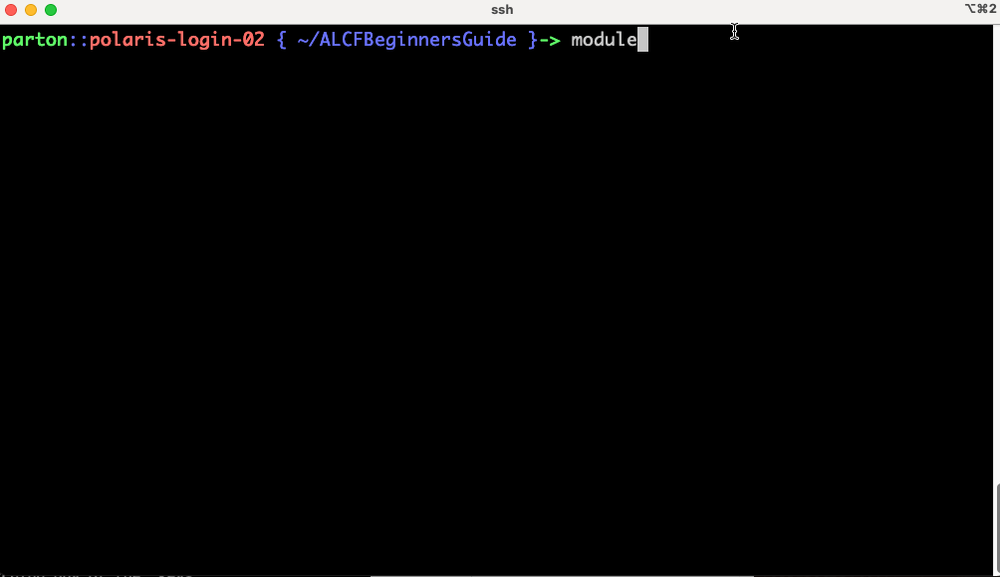

# Compilers on Polaris

The `module avail` command will show you all the compilers that are available in the current environment, while `module list` will show currently loaded modules. 

# Compiling C/C++ code

When you first login to Polaris, the version of `gcc`/`g++` will be from the OS installation, which is typically old and not intended for use. Doing `module load gcc` will give you a default version of `gcc`/`g++` that is more recent (11.2.0 as of this writing).

### Example code: [`01_example.cpp`](examples/01_example.cpp)
```c++
#include <iostream>

int main(void){

   std::cout << "Hello World!\n";
   return 0;
}
```

Build and run on a Polaris login node or worker node
```bash
module load gcc
g++ example.cpp -o example_cpp
./example_cpp
```

__NOTE:__ that this only uses the CPU. CUDA is required to use the GPU.



# Compiling C/C++ with CUDA

In order to compile a C/C++ program with CUDA, you might load the latest CUDA toolkit and GCC modules. As of this writing that looked like:
```bash
module load cudatoolkit-standalone gcc
```
This will add the path to these software to your `PATH` and `LD_LIBRARY_PATH` environment variables. Then you should be able to use `gcc`/`g++` and `nvcc` as usual to build your code.

### Example code: [`01_example.cu`](examples/01_example.cu)
```c++
#include <iostream>
#include <cmath>
#include <cstdlib>
#include <chrono>

// create a GPU and CPU kernel to calculate the Matrix Multiplication:
// A * B = C

// GPU
__global__
void naive_matrix_multiply_gpu(double const * const A, double const * const B, double * const C, const int a, const int b, const int c)
{
  const int row = blockIdx.y * blockDim.y + threadIdx.y;
  const int col = blockIdx.x * blockDim.x + threadIdx.x;
  // check boundry conditions
  if( row < a && col < c){
    // do the multiplication for one row and col
    double value = 0;
    for(int k = 0; k < b; k++){
      value += A[row * b + k] * B[k * c + col];
    }
    // store the result
    C[row * c + col] = value;
  }
}

// CPU
void naive_matrix_multiply_cpu(double const * const A, double const * const B, double * const C, const int a, const int b, const int c)
{

  for(int row=0;row<a;++row){
   for(int col=0;col<c;++col){
     // check boundry conditions
     if( row < a && col < c){
       // do the multiplication for one row and col
       double value = 0;
       for(int k = 0; k < b; k++){
         value += A[row * b + k] * B[k * c + col];
       }
       // store the result
       C[row * c + col] = value;
     }
   }
  }
}

int main(void){
   // set random number seed
   srand(2323);
   // matrix dimensions A = [ a x b ], B = [ b x c ], A x B = [ a x c ]
   const int a = 350;
   const int b = 400;
   const int c = 600;

   // CUDA thread block size
   const int BLOCK_SIZE = 16;
   dim3 thread_block(BLOCK_SIZE,BLOCK_SIZE,1);
   // CUDA Grid size is set by the output dimensions of A x B
   const int GRID_SIZE_ROW = ceilf(a/(float)BLOCK_SIZE);
   const int GRID_SIZE_COL = ceilf(c/(float)BLOCK_SIZE);
   dim3 grid_block(GRID_SIZE_ROW,GRID_SIZE_COL,1);

   // create host-side matrices
   double A[ a * b ] = {0.};
   double B[ b * c ] = {0.};
   double C[ a * c ] = {0.};
   // fill host-side matrices randomly
   for(int ai=0;ai<a;++ai)
      for(int bi=0;bi<b;++bi)
         A[ai*a + bi] = 1.*(double)rand()/(double)RAND_MAX;

   for(int bi=0;bi<b;++bi)
      for(int ci=0;ci<c;++ci)
         B[bi*b + ci] = 1.*(double)rand()/(double)RAND_MAX;

   // create device-side matrices, allocate device-side memory
   double *d_A, *d_B, *d_C;
   cudaMalloc(&d_A,a*b*sizeof(double));
   cudaMalloc(&d_B,b*c*sizeof(double));
   cudaMalloc(&d_C,a*c*sizeof(double));

   // copy A & B from host to device
   cudaMemcpy(d_A,A,a*b*sizeof(double),cudaMemcpyHostToDevice);
   cudaMemcpy(d_B,B,b*c*sizeof(double),cudaMemcpyHostToDevice);

   // Run the GPU kernel and time it.
   auto start = std::chrono::steady_clock::now();
   naive_matrix_multiply_gpu<<<grid_block,thread_block>>>(d_A,d_B,d_C,a,b,c);
   cudaDeviceSynchronize();
   auto end = std::chrono::steady_clock::now();
   std::chrono::duration<double> elapsed_seconds = end-start;
   std::cout << "gpu time: " << elapsed_seconds.count() << "\n";

   // Run the CPU kernel and time it.
   start = std::chrono::steady_clock::now();
   naive_matrix_multiply_cpu(A,B,C,a,b,c);
   end = std::chrono::steady_clock::now();
   elapsed_seconds = end-start;
   std::cout << "cpu time: " << elapsed_seconds.count() << "\n";

   return 0;
}
```

Next compile the example using on the login node:
```bash
# load the cuda toolkit and GCC modules
module load cudatoolkit-standalone gcc
# compile using NVCC and tell it the GPU Compute arcitecture (SM80)
nvcc -arch=sm_80 example.cu -o example_cu
```

### Submit script: [`01_example.sh`](examples/01_example.sh)
```bash
#!/bin/bash
#PBS -l select=1
#PBS -l walltime=00:10:00
#PBS -q debug
#PBS -l filesystems=home
#PBS -A <project-name>
#PBS -o logs/
#PBS -e logs/

module load cudatoolkit-standalone gcc

/path/to/example_cu
```

and submit your job:
```bash
qsub 01_example.sh
```

The output should look like this in the `01_example.sh.o<jobID>` file:
```
gpu time: 0.000716863
cpu time: 0.274146
```


# Compiling C/C++ with MPI

