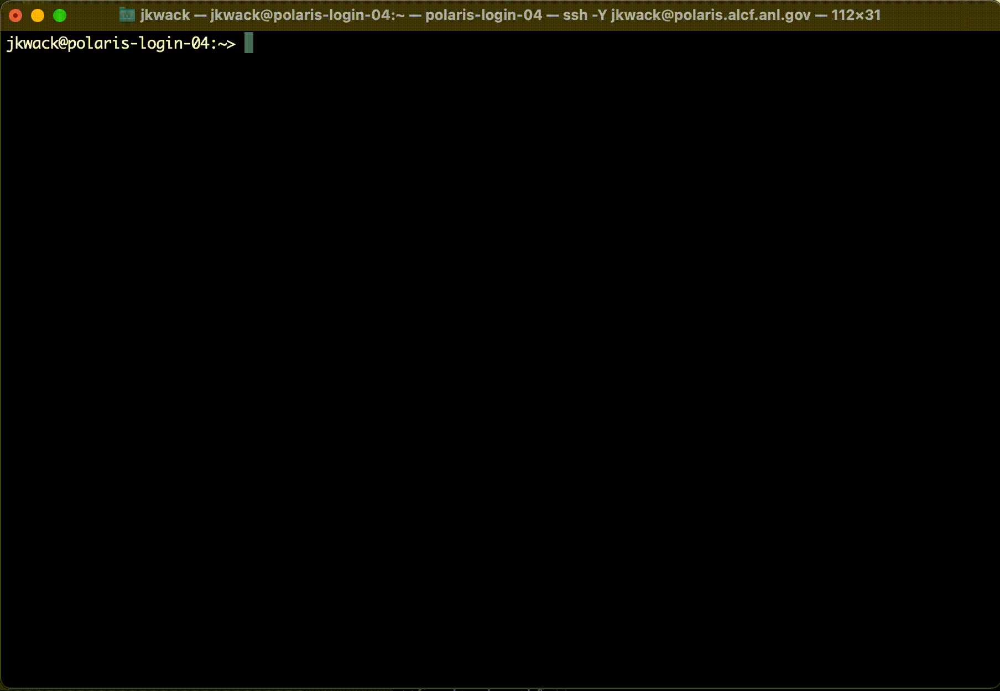
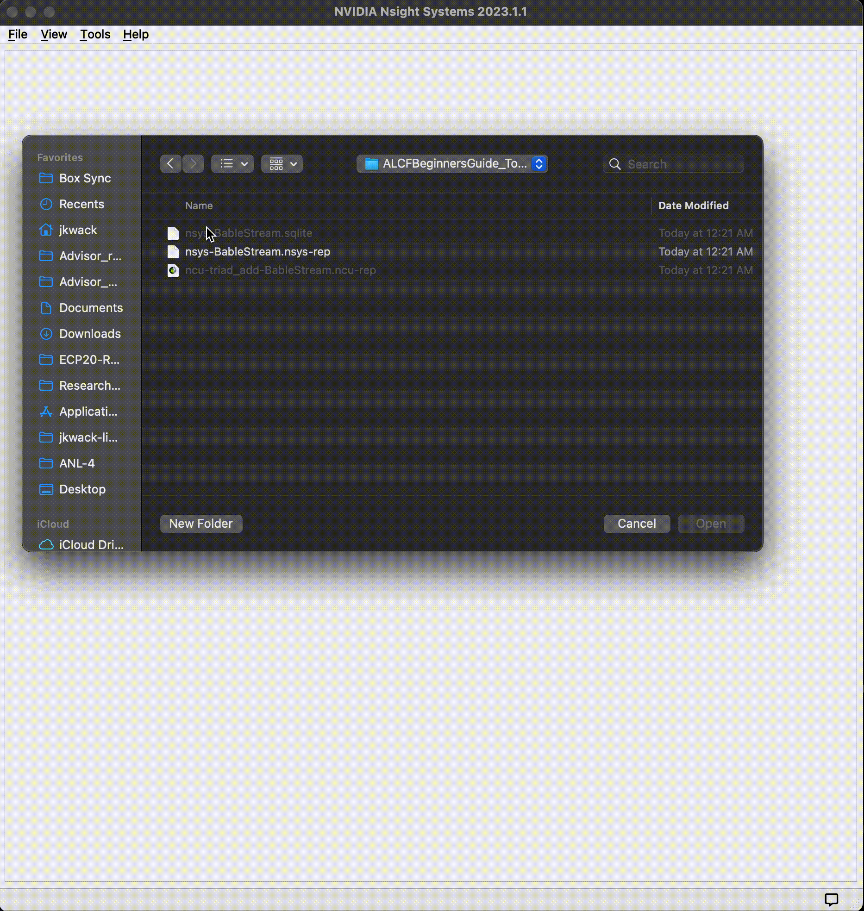
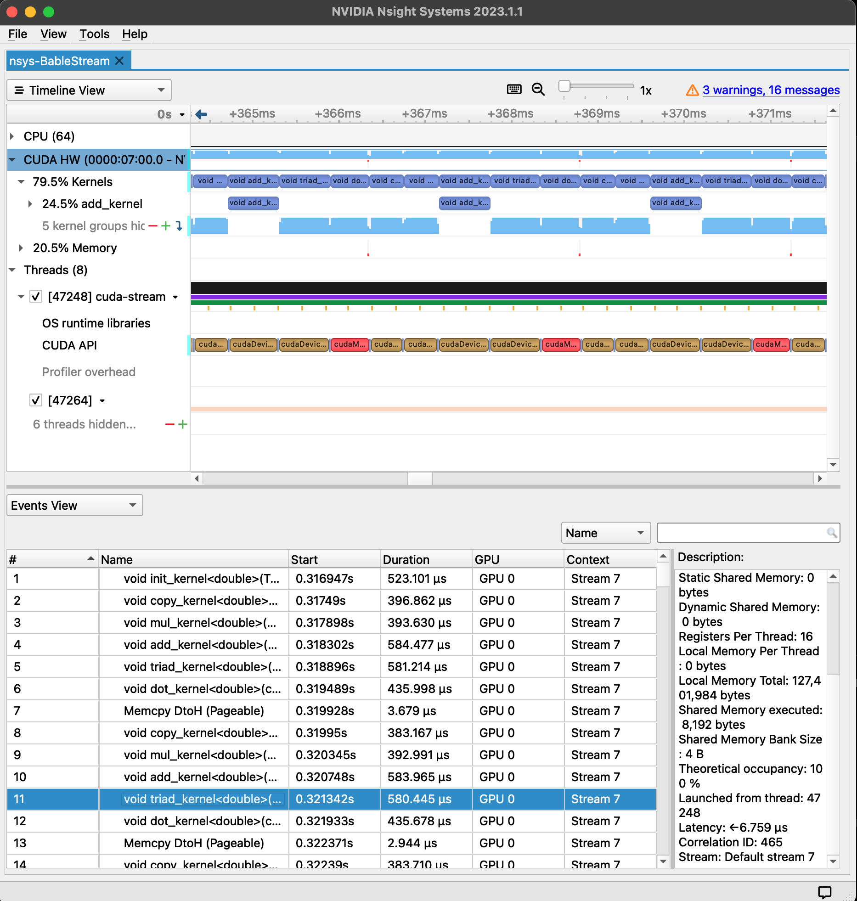
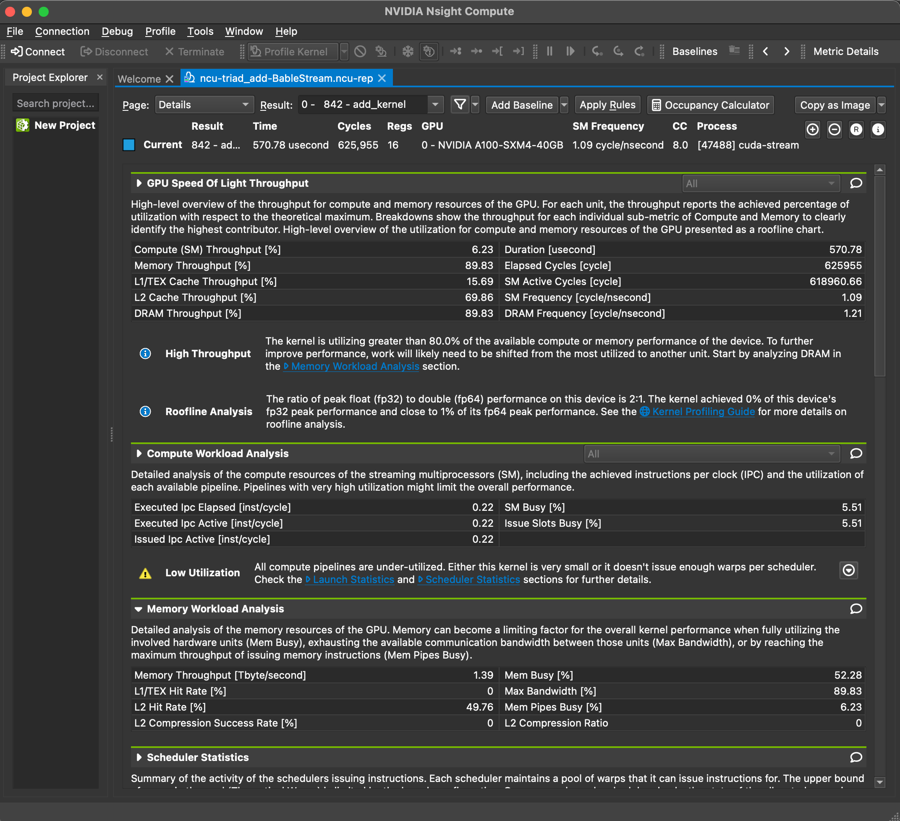
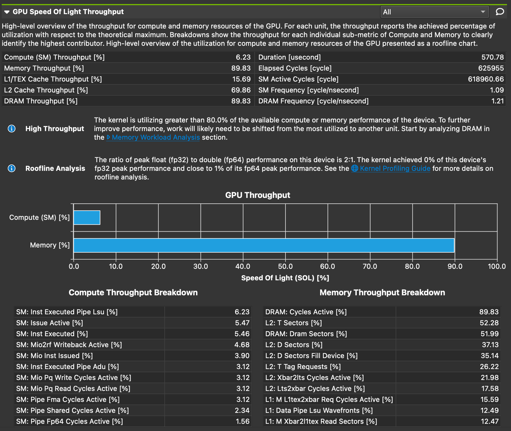
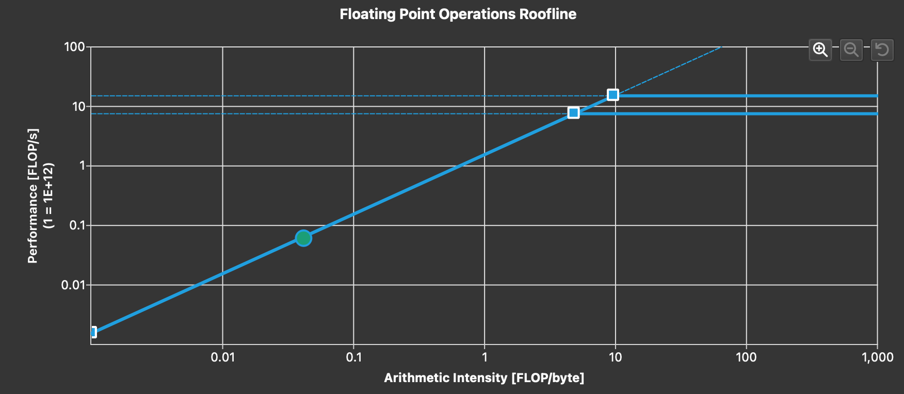
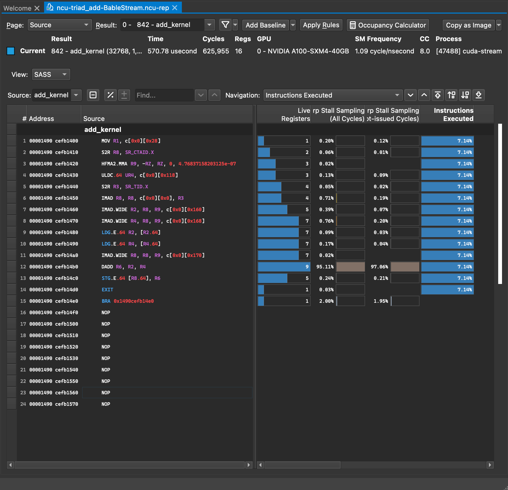

# Profiling with NVIDIA Nsight tools

NVIDIA® Nsight™ Systems provides developers a system-wide visualization of an applications performance. Developers can optimize bottlenecks to scale efficiently across any number or size of CPUs and GPUs on Polaris. For further optimizations to compute kernels developers should use Nsight Compute.

The NVIDIA Nsight Compute is an interactive kernel profiler for CUDA applications. It provides detailed performance metrics and API debugging via a user interface and command line tool.

In addition, the baseline feature of this tool allows users to compare results within the tool. NVIDIA Nsight Compute provides a customizable and data-driven user interface, metric collection, and can be extended with analysis scripts for post-processing results.

### Users are assumed to know:
* basic usage of NVidia NSight System and Compute profilers
### Learning Goals:
* How to run NVidia profilers on Polaris
* Installing NVidia profilers on your local machine
* Viewing results produced on Polaris on your local machine


## Step-by-step guide

### Common part on Polaris
Build your application for Polaris, and then submit your job script to Polaris or start an interactive job mode on Polaris as follows:  
```
$ qsub -I -l select=1 -l walltime=1:00:00 -l filesystems=home:eagle -q debug -A <project-name>

$ module use /soft/modulefiles
$ module load cudatoolkit-standalone/12.5.0 
$ module li

Currently Loaded Modules:
  1) nvhpc/23.9          5) cray-pmi/6.1.13      9) PrgEnv-nvhpc/8.5.0      13) darshan/3.4.4
  2) craype/2.7.30       6) cray-pals/1.3.4     10) libfabric/1.15.2.0      14) cudatoolkit-standalone/12.5.0
  3) cray-dsmml/0.2.2    7) cray-libpals/1.3.4  11) craype-network-ofi
  4) cray-mpich/8.1.28   8) craype-x86-milan    12) perftools-base/23.12.0
 
$ nsys --version
NVIDIA Nsight Systems version 2024.2.3.38-242334140272v0

$ ncu --version
NVIDIA (R) Nsight Compute Command Line Profiler
Copyright (c) 2018-2024 NVIDIA Corporation
Version 2024.2.0.0 (build 34181891) (public-release)
```


### Nsight Systems
Run your application with Nsight Systems as follows:  
```
$ nsys profile -o {output_filename} --stats=true ./{your_application}
```

### Nsight Compute
Run your application with Nsight Compute.  
```
$ ncu --set detailed -k {kernel_name} -o {output_filename} ./{your_application}
```

Remark: Without -o option, Nsight Compute provides performance data as a standard output

### Post-processing the profiled data
#### Post-processing via CLI
```
$ nsys stats {output_filename}.nsys-rep
$ ncu -i {output_filename}.ncu-rep  
```

#### Post-processing on your local system via GUI
* Install [NVIDIA Nsight Systems](https://developer.nvidia.com/nsight-systems) and [NVIDIA Nsight Compute](https://developer.nvidia.com/nsight-compute) after downloading both of them from the  NVIDIA Developer Zone.   
Remark: Local client version should be the same as or newer than NVIDIA Nsight tools on Polaris. 
* Download nsys output files (i.e., ending with .nsys-rep and . sqlite) to your local system, and then open them with NVIDIA Nsight Systems on your local system.  
* Download ncu output files (i.e., ending with .ncu-rep) to your local system, and then open them with NVIDIA Nsight Compute on your local system.  

### More options for performance analysis with Nsight Systems and Nsight Compute
```
$ nsys --help
$ ncu --help
```

## A quick example

### Build an example


```
jkwack@polaris-login-02:~> qsub -I -l select=1 -l walltime=01:00:00 -q debug -l filesystems=home:eagle -A Performance
qsub: waiting for job 2022713.polaris-pbs-01.hsn.cm.polaris.alcf.anl.gov to start
qsub: job 2022713.polaris-pbs-01.hsn.cm.polaris.alcf.anl.gov ready

jkwack@x3005c0s7b0n0:~> module use /soft/modulefiles
jkwack@x3005c0s7b0n0:~> module load cudatoolkit-standalone/12.5.0 spack-pe-base cmake
jkwack@x3005c0s7b0n0:~> module li

Currently Loaded Modules:
  1) nvhpc/23.9          6) cray-pals/1.3.4     11) craype-network-ofi             16) nghttp2/1.57.0-ciat5hu
  2) craype/2.7.30       7) cray-libpals/1.3.4  12) perftools-base/23.12.0         17) curl/8.4.0-2ztev25
  3) cray-dsmml/0.2.2    8) craype-x86-milan    13) darshan/3.4.4                  18) cmake/3.27.7
  4) cray-mpich/8.1.28   9) PrgEnv-nvhpc/8.5.0  14) cudatoolkit-standalone/12.5.0
  5) cray-pmi/6.1.13    10) libfabric/1.15.2.0  15) spack-pe-base/0.7.1

jkwack@x3005c0s7b0n0:~> cd ALCFBeginnersGuide/polaris/examples
jkwack@x3005c0s7b0n0:~/ALCFBeginnersGuide/polaris/examples> git clone https://github.com/UoB-HPC/BabelStream.git
Cloning into 'BabelStream'...
remote: Enumerating objects: 4829, done.
remote: Counting objects: 100% (1257/1257), done.
remote: Compressing objects: 100% (303/303), done.
remote: Total 4829 (delta 1071), reused 1044 (delta 953), pack-reused 3572
Receiving objects: 100% (4829/4829), 2.44 MiB | 6.74 MiB/s, done.
Resolving deltas: 100% (2953/2953), done.

jkwack@x3005c0s7b0n0:~/ALCFBeginnersGuide/polaris/examples> cd BabelStream
jkwack@x3005c0s7b0n0:~/ALCFBeginnersGuide/polaris/examples/BabelStream> cmake -Bbuild_polaris -H. -DMODEL=cuda -DCMAKE_CUDA_COMPILER=nvcc -DCUDA_ARCH=sm_80 -DCXX_EXTRA_FLAGS="-DDEBUG"
-- The CXX compiler identification is GNU 7.5.0
-- The C compiler identification is GNU 7.5.0
-- Detecting CXX compiler ABI info
-- Detecting CXX compiler ABI info - done
-- Check for working CXX compiler: /usr/bin/c++ - skipped
-- Detecting CXX compile features
-- Detecting CXX compile features - done
-- Detecting C compiler ABI info
-- Detecting C compiler ABI info - done
-- Check for working C compiler: /usr/bin/cc - skipped
-- Detecting C compile features
-- Detecting C compile features - done
No CMAKE_BUILD_TYPE specified, defaulting to 'Release'
-- CXX_EXTRA_LINK_FLAGS: 
        Appends to link flags which appear *before* the objects.
        Do not use this for linking libraries, as the link line is order-dependent
-- CXX_EXTRA_LIBRARIES: 
        Append to link flags which appear *after* the objects.
        Use this for linking extra libraries (e.g `-lmylib`, or simply `mylib`)
-- CXX_EXTRA_LINKER_FLAGS: 
        Append to linker flags (i.e GCC's `-Wl` or equivalent)
-- Available models:  omp;ocl;std-data;std-indices;std-ranges;hip;cuda;kokkos;sycl;sycl2020-acc;sycl2020-usm;acc;raja;tbb;thrust;futhark
-- Selected model  :  cuda
-- Supported flags:

   CMAKE_CXX_COMPILER (optional, default=c++): Any CXX compiler that is supported by CMake detection, this is used for host compilation
   MEM (optional, default=DEFAULT): Device memory mode:
        DEFAULT   - allocate host and device memory pointers.
        MANAGED   - use CUDA Managed Memory.
        PAGEFAULT - shared memory, only host pointers allocated.
   CMAKE_CUDA_COMPILER (required): Path to the CUDA nvcc compiler
   CUDA_ARCH (required): Nvidia architecture, will be passed in via `-arch=` (e.g `sm_70`) for nvcc
   CUDA_EXTRA_FLAGS (optional, default=): Additional CUDA flags passed to nvcc, this is appended after `CUDA_ARCH`

-- Model-specific flags for this build:

   CMAKE_CXX_COMPILER = `/usr/bin/c++`
   MEM = `DEFAULT`
   CMAKE_CUDA_COMPILER = `nvcc`
   CUDA_ARCH = `sm_80`
   CUDA_EXTRA_FLAGS = ``

CMake Deprecation Warning at src/cuda/model.cmake:28 (cmake_policy):
  The OLD behavior for policy CMP0104 will be removed from a future version
  of CMake.

  The cmake-policies(7) manual explains that the OLD behaviors of all
  policies are deprecated and that a policy should be set to OLD only under
  specific short-term circumstances.  Projects should be ported to the NEW
  behavior and not rely on setting a policy to OLD.
Call Stack (most recent call first):
  CMakeLists.txt:196 (setup)


-- The CUDA compiler identification is NVIDIA 12.5.40
-- Detecting CUDA compiler ABI info
-- Detecting CUDA compiler ABI info - done
-- Check for working CUDA compiler: /soft/compilers/cudatoolkit/cuda-12.5.0/bin/nvcc - skipped
-- Detecting CUDA compile features
-- Detecting CUDA compile features - done
-- NVCC flags: -forward-unknown-to-host-compiler -arch=sm_80  -DNDEBUG
-- Default Release flags are `-O3;-march=native`, set RELEASE_FLAGS to override (CXX_EXTRA_* flags are not affected)
-- CXX vendor  : GNU (/usr/bin/c++)
-- Platform    : x86_64
-- Sources     : src/cuda/CUDAStream.cu
-- Libraries   : 
-- CXX Flags   :  -DNDEBUG -O3;-march=native -DDEBUG
    CXX flags derived from (CMake + (Override ? Override : Default) + Extras), where:
        CMake                    = ` -DNDEBUG`
        Default                  = `-O3;-march=native`
        Override (RELEASE_FLAGS) = ``
        Extras (CXX_EXTRA_FLAGS) = `-DDEBUG`
-- Link Flags  :  -DDEBUG
-- Linker Flags:   
-- Defs        : CUDA;DEFAULT
-- Executable  : cuda-stream
-- Configuring done (4.5s)
-- Generating done (0.0s)
-- Build files have been written to: /home/jkwack/ALCFBeginnersGuide/polaris/examples/BabelStream/build_polaris

jkwack@x3005c0s7b0n0:~/ALCFBeginnersGuide/polaris/examples/BabelStream> cmake --build build_polaris
[ 33%] Building CUDA object CMakeFiles/cuda-stream.dir/src/cuda/CUDAStream.cu.o
[ 66%] Building CXX object CMakeFiles/cuda-stream.dir/src/main.cpp.o
[100%] Linking CXX executable cuda-stream
[100%] Built target cuda-stream

jkwack@x3005c0s7b0n0:~/ALCFBeginnersGuide/polaris/examples/BabelStream> cd build_polaris/

jkwack@x3005c0s7b0n0:~/ALCFBeginnersGuide/polaris/examples/BabelStream/build_polaris> ./cuda-stream 
BabelStream
Version: 5.0
Implementation: CUDA
Running kernels 100 times
Precision: double
Array size: 268.4 MB (=0.3 GB)
Total size: 805.3 MB (=0.8 GB)
Using CUDA device NVIDIA A100-SXM4-40GB
Driver: 12020
Memory: DEFAULT
Reduction kernel config: 432 groups of (fixed) size 1024
Init: 0.065250 s (=12341.874989 MBytes/sec)
Read: 0.000748 s (=1077026.035391 MBytes/sec)
Function    MBytes/sec  Min (sec)   Max         Average     
Copy        1400256.415 0.00038     0.00039     0.00039     
Mul         1360437.756 0.00039     0.00040     0.00040     
Add         1369584.958 0.00059     0.00060     0.00059     
Triad       1377517.491 0.00058     0.00060     0.00059     
Dot         1353461.767 0.00040     0.00041     0.00040     
```

### Nsight Systems


#### Running a stream benchmark with Nsight Systems
```
jkwack@x3005c0s7b0n0:~/ALCFBeginnersGuide/polaris/examples/BabelStream/build_polaris> nsys profile -o nsys-BableStream --stats=true ./cuda-stream
BabelStream
Version: 5.0
Implementation: CUDA
Running kernels 100 times
Precision: double
Array size: 268.4 MB (=0.3 GB)
Total size: 805.3 MB (=0.8 GB)
Using CUDA device NVIDIA A100-SXM4-40GB
Driver: 12020
Memory: DEFAULT
Reduction kernel config: 432 groups of (fixed) size 1024
Init: 0.066406 s (=12126.945664 MBytes/sec)
Read: 0.000765 s (=1052155.795696 MBytes/sec)
Function    MBytes/sec  Min (sec)   Max         Average     
Copy        1375100.627 0.00039     0.00040     0.00039     
Mul         1342039.721 0.00040     0.00040     0.00040     
Add         1364493.572 0.00059     0.00059     0.00059     
Triad       1373162.696 0.00059     0.00059     0.00059     
Dot         1334752.718 0.00040     0.00041     0.00041     
Generating '/var/tmp/pbs.2022713.polaris-pbs-01.hsn.cm.polaris.alcf.anl.gov/nsys-report-2abb.qdstrm'
[1/8] [========================100%] nsys-BableStream.nsys-rep
[2/8] [========================100%] nsys-BableStream.sqlite
[3/8] Executing 'nvtx_sum' stats report
SKIPPED: /home/jkwack/ALCFBeginnersGuide/polaris/examples/BabelStream/build_polaris/nsys-BableStream.sqlite does not contain NV Tools Extension (NVTX) data.
[4/8] Executing 'osrt_sum' stats report

 Time (%)  Total Time (ns)  Num Calls    Avg (ns)      Med (ns)    Min (ns)   Max (ns)    StdDev (ns)        Name     
 --------  ---------------  ---------  ------------  ------------  --------  -----------  ------------  --------------
     63.7      601,029,880         19  31,633,151.6  15,201,463.0     5,490  100,146,184  41,789,533.1  poll          
     33.2      313,402,461      1,055     297,063.9      14,147.0     1,042   36,079,881   1,326,292.7  ioctl         
      2.4       22,359,798         56     399,282.1       4,754.0     2,354   18,287,435   2,450,902.6  fopen         
      0.4        3,882,369         42      92,437.4       7,954.5     6,251    2,831,364     434,274.6  mmap64        
      0.1        1,392,194         12     116,016.2      70,001.5    37,340      660,340     172,190.1  sem_timedwait 
      0.1          513,244          4     128,311.0     125,706.5   110,397      151,434      17,599.5  pthread_create
      0.1          499,648         83       6,019.9       5,460.0     3,146       18,415       1,807.5  open64        
      0.0          171,063         20       8,553.2       3,151.0     1,002       95,019      20,557.3  mmap          
      0.0           92,647         47       1,971.2       1,914.0     1,242        3,356         412.4  fclose        
      0.0           65,273          1      65,273.0      65,273.0    65,273       65,273           0.0  fgets         
      0.0           50,594         12       4,216.2       3,246.0     2,214       10,810       2,553.9  munmap        
      0.0           43,243          7       6,177.6       5,641.0     2,716        9,628       2,592.3  open          
      0.0           35,380         16       2,211.3       2,430.0     1,242        3,336         625.8  read          
      0.0           30,740          8       3,842.5       3,552.5     1,002        7,825       2,956.4  putc          
      0.0           26,039         12       2,169.9       2,119.0     1,353        3,637         568.6  write         
      0.0           21,049          2      10,524.5      10,524.5     7,704       13,345       3,988.8  fread         
      0.0           16,080          1      16,080.0      16,080.0    16,080       16,080           0.0  dup           
      0.0           12,453          2       6,226.5       6,226.5     3,867        8,586       3,336.8  socket        
      0.0            9,679          1       9,679.0       9,679.0     9,679        9,679           0.0  connect       
      0.0            8,265          1       8,265.0       8,265.0     8,265        8,265           0.0  pipe2         
      0.0            5,129          2       2,564.5       2,564.5     1,663        3,466       1,274.9  fwrite        
      0.0            2,845          2       1,422.5       1,422.5     1,262        1,583         227.0  fcntl         
      0.0            1,633          1       1,633.0       1,633.0     1,633        1,633           0.0  listen        
      0.0            1,262          1       1,262.0       1,262.0     1,262        1,262           0.0  bind          

[5/8] Executing 'cuda_api_sum' stats report

 Time (%)  Total Time (ns)  Num Calls   Avg (ns)    Med (ns)   Min (ns)   Max (ns)   StdDev (ns)           Name         
 --------  ---------------  ---------  -----------  ---------  --------  ----------  -----------  ----------------------
     64.1      196,349,940        401    489,650.7  526,138.0   384,652     590,688     96,584.8  cudaDeviceSynchronize 
     34.9      106,875,399        103  1,037,625.2  404,820.0   398,438  23,138,581  3,673,961.7  cudaMemcpy            
      0.6        1,715,255        501      3,423.7    2,755.0     2,474     233,538     10,375.7  cudaLaunchKernel      
      0.3          829,027          4    207,256.8  205,476.0    72,135     345,940    112,008.3  cudaFree              
      0.1          458,190          4    114,547.5  107,862.5    77,977     164,488     38,099.1  cudaMalloc            
      0.0            2,535          1      2,535.0    2,535.0     2,535       2,535          0.0  cuModuleGetLoadingMode

[6/8] Executing 'cuda_gpu_kern_sum' stats report

 Time (%)  Total Time (ns)  Instances  Avg (ns)   Med (ns)   Min (ns)  Max (ns)  StdDev (ns)                             Name                           
 --------  ---------------  ---------  ---------  ---------  --------  --------  -----------  ----------------------------------------------------------
     25.0       58,234,880        100  582,348.8  582,333.0   581,341   583,741        505.9  void add_kernel<double>(const T1 *, const T1 *, T1 *)     
     24.8       57,859,042        100  578,590.4  578,525.0   577,565   580,413        570.8  void triad_kernel<double>(T1 *, const T1 *, const T1 *)   
     16.9       39,251,815        100  392,518.2  392,589.5   391,006   393,821        587.7  void mul_kernel<double>(T1 *, const T1 *)                 
     16.6       38,722,376        100  387,223.8  387,005.5   382,910   391,837      1,786.4  void dot_kernel<double>(const T1 *, const T1 *, T1 *, int)
     16.4       38,259,881        100  382,598.8  382,462.0   381,501   395,134      1,376.8  void copy_kernel<double>(const T1 *, T1 *)                
      0.2          521,885          1  521,885.0  521,885.0   521,885   521,885          0.0  void init_kernel<double>(T1 *, T1 *, T1 *, T1, T1, T1)    

[7/8] Executing 'cuda_gpu_mem_time_sum' stats report

 Time (%)  Total Time (ns)  Count  Avg (ns)   Med (ns)  Min (ns)   Max (ns)   StdDev (ns)           Operation          
 --------  ---------------  -----  ---------  --------  --------  ----------  -----------  ----------------------------
    100.0       66,303,506    103  643,723.4   2,432.0     2,400  22,998,241  3,722,456.6  [CUDA memcpy Device-to-Host]

[8/8] Executing 'cuda_gpu_mem_size_sum' stats report

 Total (MB)  Count  Avg (MB)  Med (MB)  Min (MB)  Max (MB)  StdDev (MB)           Operation          
 ----------  -----  --------  --------  --------  --------  -----------  ----------------------------
    805.652    103     7.822     0.003     0.003   268.435       45.360  [CUDA memcpy Device-to-Host]

Generated:
    /home/jkwack/ALCFBeginnersGuide/polaris/examples/BabelStream/build_polaris/nsys-BableStream.nsys-rep
    /home/jkwack/ALCFBeginnersGuide/polaris/examples/BabelStream/build_polaris/nsys-BableStream.sqlite
```

#### Reviewing the Nsight Systems data via GUI




### Nsight Compute
#### Running a stream benchmark with Nsight Compute for triad_kernel
```
jkwack@x3005c0s7b0n0:~/ALCFBeginnersGuide/polaris/examples/BabelStream/build_polaris> ncu --set detailed -k regex:"triad|add" -o ncu-triad_add-BableStream ./cuda-stream
BabelStream
Version: 5.0
Implementation: CUDA
Running kernels 100 times
Precision: double
Array size: 268.4 MB (=0.3 GB)
Total size: 805.3 MB (=0.8 GB)
==PROF== Connected to process 2881032 (/home/jkwack/ALCFBeginnersGuide/polaris/examples/BabelStream/build_polaris/cuda-stream)
Using CUDA device NVIDIA A100-SXM4-40GB
Driver: 12020
Memory: DEFAULT
Reduction kernel config: 432 groups of (fixed) size 1024
==PROF== Profiling "add_kernel": 0%....50%....100% - 18 passes
==PROF== Profiling "triad_kernel": 0%....50%....100% - 18 passes
==PROF== Profiling "add_kernel": 0%....50%....100% - 18 passes
==PROF== Profiling "triad_kernel": 0%....50%....100% - 18 passes
==PROF== Profiling "add_kernel": 0%....50%....100% - 18 passes
==PROF== Profiling "triad_kernel": 0%....50%....100% - 18 passes
==PROF== Profiling "add_kernel": 0%....50%....100% - 18 passes
==PROF== Profiling "triad_kernel": 0%....50%....100% - 18 passes
==PROF== Profiling "add_kernel": 0%....50%....100% - 18 passes
==PROF== Profiling "triad_kernel": 0%....50%....100% - 18 passes
==PROF== Profiling "add_kernel": 0%....50%....100% - 18 passes
==PROF== Profiling "triad_kernel": 0%....50%....100% - 18 passes
==PROF== Profiling "add_kernel": 0%....50%....100% - 18 passes
==PROF== Profiling "triad_kernel": 0%....50%....100% - 18 passes
==PROF== Profiling "add_kernel": 0%....50%....100% - 18 passes
==PROF== Profiling "triad_kernel": 0%....50%....100% - 18 passes
==PROF== Profiling "add_kernel": 0%....50%....100% - 18 passes
==PROF== Profiling "triad_kernel": 0%....50%....100% - 18 passes
==PROF== Profiling "add_kernel": 0%....50%....100% - 18 passes
==PROF== Profiling "triad_kernel": 0%....50%....100% - 18 passes
==PROF== Profiling "add_kernel": 0%....50%....100% - 18 passes
==PROF== Profiling "triad_kernel": 0%....50%....100% - 18 passes
==PROF== Profiling "add_kernel": 0%....50%....100% - 18 passes
==PROF== Profiling "triad_kernel": 0%....50%....100% - 18 passes
==PROF== Profiling "add_kernel": 0%....50%....100% - 18 passes
==PROF== Profiling "triad_kernel": 0%....50%....100% - 18 passes
==PROF== Profiling "add_kernel": 0%....50%....100% - 18 passes
==PROF== Profiling "triad_kernel": 0%....50%....100% - 18 passes
==PROF== Profiling "add_kernel": 0%....50%....100% - 18 passes
==PROF== Profiling "triad_kernel": 0%....50%....100% - 18 passes
==PROF== Profiling "add_kernel": 0%....50%....100% - 18 passes
==PROF== Profiling "triad_kernel": 0%....50%....100% - 18 passes
==PROF== Profiling "add_kernel": 0%....50%....100% - 18 passes
==PROF== Profiling "triad_kernel": 0%....50%....100% - 18 passes
==PROF== Profiling "add_kernel": 0%....50%....100% - 18 passes
==PROF== Profiling "triad_kernel": 0%....50%....100% - 18 passes
==PROF== Profiling "add_kernel": 0%....50%....100% - 18 passes
==PROF== Profiling "triad_kernel": 0%....50%....100% - 18 passes
==PROF== Profiling "add_kernel": 0%....50%....100% - 18 passes
==PROF== Profiling "triad_kernel": 0%....50%....100% - 18 passes
==PROF== Profiling "add_kernel": 0%....50%....100% - 18 passes
==PROF== Profiling "triad_kernel": 0%....50%....100% - 18 passes
==PROF== Profiling "add_kernel": 0%....50%....100% - 18 passes
==PROF== Profiling "triad_kernel": 0%....50%....100% - 18 passes
==PROF== Profiling "add_kernel": 0%....50%....100% - 18 passes
==PROF== Profiling "triad_kernel": 0%....50%....100% - 18 passes
==PROF== Profiling "add_kernel": 0%....50%....100% - 18 passes
==PROF== Profiling "triad_kernel": 0%....50%....100% - 18 passes
==PROF== Profiling "add_kernel": 0%....50%....100% - 18 passes
==PROF== Profiling "triad_kernel": 0%....50%....100% - 18 passes
==PROF== Profiling "add_kernel": 0%....50%....100% - 18 passes
==PROF== Profiling "triad_kernel": 0%....50%....100% - 18 passes
==PROF== Profiling "add_kernel": 0%....50%....100% - 18 passes
==PROF== Profiling "triad_kernel": 0%....50%....100% - 18 passes
==PROF== Profiling "add_kernel": 0%....50%....100% - 18 passes
==PROF== Profiling "triad_kernel": 0%....50%....100% - 18 passes
==PROF== Profiling "add_kernel": 0%....50%....100% - 18 passes
==PROF== Profiling "triad_kernel": 0%....50%....100% - 18 passes
==PROF== Profiling "add_kernel": 0%....50%....100% - 18 passes
==PROF== Profiling "triad_kernel": 0%....50%....100% - 18 passes
==PROF== Profiling "add_kernel": 0%....50%....100% - 18 passes
==PROF== Profiling "triad_kernel": 0%....50%....100% - 18 passes
==PROF== Profiling "add_kernel": 0%....50%....100% - 18 passes
==PROF== Profiling "triad_kernel": 0%....50%....100% - 18 passes
==PROF== Profiling "add_kernel": 0%....50%....100% - 18 passes
==PROF== Profiling "triad_kernel": 0%....50%....100% - 18 passes
==PROF== Profiling "add_kernel": 0%....50%....100% - 18 passes
==PROF== Profiling "triad_kernel": 0%....50%....100% - 18 passes
==PROF== Profiling "add_kernel": 0%....50%....100% - 18 passes
==PROF== Profiling "triad_kernel": 0%....50%....100% - 18 passes
==PROF== Profiling "add_kernel": 0%....50%....100% - 18 passes
==PROF== Profiling "triad_kernel": 0%....50%....100% - 18 passes
==PROF== Profiling "add_kernel": 0%....50%....100% - 18 passes
==PROF== Profiling "triad_kernel": 0%....50%....100% - 18 passes
==PROF== Profiling "add_kernel": 0%....50%....100% - 18 passes
==PROF== Profiling "triad_kernel": 0%....50%....100% - 18 passes
==PROF== Profiling "add_kernel": 0%....50%....100% - 18 passes
==PROF== Profiling "triad_kernel": 0%....50%....100% - 18 passes
==PROF== Profiling "add_kernel": 0%....50%....100% - 18 passes
==PROF== Profiling "triad_kernel": 0%....50%....100% - 18 passes
==PROF== Profiling "add_kernel": 0%....50%....100% - 18 passes
==PROF== Profiling "triad_kernel": 0%....50%....100% - 18 passes
==PROF== Profiling "add_kernel": 0%....50%....100% - 18 passes
==PROF== Profiling "triad_kernel": 0%....50%....100% - 18 passes
==PROF== Profiling "add_kernel": 0%....50%....100% - 18 passes
==PROF== Profiling "triad_kernel": 0%....50%....100% - 18 passes
==PROF== Profiling "add_kernel": 0%....50%....100% - 18 passes
==PROF== Profiling "triad_kernel": 0%....50%....100% - 18 passes
==PROF== Profiling "add_kernel": 0%....50%....100% - 18 passes
==PROF== Profiling "triad_kernel": 0%....50%....100% - 18 passes
==PROF== Profiling "add_kernel": 0%....50%....100% - 18 passes
==PROF== Profiling "triad_kernel": 0%....50%....100% - 18 passes
==PROF== Profiling "add_kernel": 0%....50%....100% - 18 passes
==PROF== Profiling "triad_kernel": 0%....50%....100% - 18 passes
==PROF== Profiling "add_kernel": 0%....50%....100% - 18 passes
==PROF== Profiling "triad_kernel": 0%....50%....100% - 18 passes
==PROF== Profiling "add_kernel": 0%....50%....100% - 18 passes
==PROF== Profiling "triad_kernel": 0%....50%....100% - 18 passes
==PROF== Profiling "add_kernel": 0%....50%....100% - 18 passes
==PROF== Profiling "triad_kernel": 0%....50%....100% - 18 passes
==PROF== Profiling "add_kernel": 0%....50%....100% - 18 passes
==PROF== Profiling "triad_kernel": 0%....50%....100% - 18 passes
==PROF== Profiling "add_kernel": 0%....50%....100% - 18 passes
==PROF== Profiling "triad_kernel": 0%....50%....100% - 18 passes
==PROF== Profiling "add_kernel": 0%....50%....100% - 18 passes
==PROF== Profiling "triad_kernel": 0%....50%....100% - 18 passes
==PROF== Profiling "add_kernel": 0%....50%....100% - 18 passes
==PROF== Profiling "triad_kernel": 0%....50%....100% - 18 passes
==PROF== Profiling "add_kernel": 0%....50%....100% - 18 passes
==PROF== Profiling "triad_kernel": 0%....50%....100% - 18 passes
==PROF== Profiling "add_kernel": 0%....50%....100% - 18 passes
==PROF== Profiling "triad_kernel": 0%....50%....100% - 18 passes
==PROF== Profiling "add_kernel": 0%....50%....100% - 18 passes
==PROF== Profiling "triad_kernel": 0%....50%....100% - 18 passes
==PROF== Profiling "add_kernel": 0%....50%....100% - 18 passes
==PROF== Profiling "triad_kernel": 0%....50%....100% - 18 passes
==PROF== Profiling "add_kernel": 0%....50%....100% - 18 passes
==PROF== Profiling "triad_kernel": 0%....50%....100% - 18 passes
==PROF== Profiling "add_kernel": 0%....50%....100% - 18 passes
==PROF== Profiling "triad_kernel": 0%....50%....100% - 18 passes
==PROF== Profiling "add_kernel": 0%....50%....100% - 18 passes
==PROF== Profiling "triad_kernel": 0%....50%....100% - 18 passes
==PROF== Profiling "add_kernel": 0%....50%....100% - 18 passes
==PROF== Profiling "triad_kernel": 0%....50%....100% - 18 passes
==PROF== Profiling "add_kernel": 0%....50%....100% - 18 passes
==PROF== Profiling "triad_kernel": 0%....50%....100% - 18 passes
==PROF== Profiling "add_kernel": 0%....50%....100% - 18 passes
==PROF== Profiling "triad_kernel": 0%....50%....100% - 18 passes
==PROF== Profiling "add_kernel": 0%....50%....100% - 18 passes
==PROF== Profiling "triad_kernel": 0%....50%....100% - 18 passes
==PROF== Profiling "add_kernel": 0%....50%....100% - 18 passes
==PROF== Profiling "triad_kernel": 0%....50%....100% - 18 passes
==PROF== Profiling "add_kernel": 0%....50%....100% - 18 passes
==PROF== Profiling "triad_kernel": 0%....50%....100% - 18 passes
==PROF== Profiling "add_kernel": 0%....50%....100% - 18 passes
==PROF== Profiling "triad_kernel": 0%....50%....100% - 18 passes
==PROF== Profiling "add_kernel": 0%....50%....100% - 18 passes
==PROF== Profiling "triad_kernel": 0%....50%....100% - 18 passes
==PROF== Profiling "add_kernel": 0%....50%....100% - 18 passes
==PROF== Profiling "triad_kernel": 0%....50%....100% - 18 passes
==PROF== Profiling "add_kernel": 0%....50%....100% - 18 passes
==PROF== Profiling "triad_kernel": 0%....50%....100% - 18 passes
==PROF== Profiling "add_kernel": 0%....50%....100% - 18 passes
==PROF== Profiling "triad_kernel": 0%....50%....100% - 18 passes
==PROF== Profiling "add_kernel": 0%....50%....100% - 18 passes
==PROF== Profiling "triad_kernel": 0%....50%....100% - 18 passes
==PROF== Profiling "add_kernel": 0%....50%....100% - 18 passes
==PROF== Profiling "triad_kernel": 0%....50%....100% - 18 passes
==PROF== Profiling "add_kernel": 0%....50%....100% - 18 passes
==PROF== Profiling "triad_kernel": 0%....50%....100% - 18 passes
==PROF== Profiling "add_kernel": 0%....50%....100% - 18 passes
==PROF== Profiling "triad_kernel": 0%....50%....100% - 18 passes
==PROF== Profiling "add_kernel": 0%....50%....100% - 18 passes
==PROF== Profiling "triad_kernel": 0%....50%....100% - 18 passes
==PROF== Profiling "add_kernel": 0%....50%....100% - 18 passes
==PROF== Profiling "triad_kernel": 0%....50%....100% - 18 passes
==PROF== Profiling "add_kernel": 0%....50%....100% - 18 passes
==PROF== Profiling "triad_kernel": 0%....50%....100% - 18 passes
==PROF== Profiling "add_kernel": 0%....50%....100% - 18 passes
==PROF== Profiling "triad_kernel": 0%....50%....100% - 18 passes
==PROF== Profiling "add_kernel": 0%....50%....100% - 18 passes
==PROF== Profiling "triad_kernel": 0%....50%....100% - 18 passes
==PROF== Profiling "add_kernel": 0%....50%....100% - 18 passes
==PROF== Profiling "triad_kernel": 0%....50%....100% - 18 passes
==PROF== Profiling "add_kernel": 0%....50%....100% - 18 passes
==PROF== Profiling "triad_kernel": 0%....50%....100% - 18 passes
==PROF== Profiling "add_kernel": 0%....50%....100% - 18 passes
==PROF== Profiling "triad_kernel": 0%....50%....100% - 18 passes
==PROF== Profiling "add_kernel": 0%....50%....100% - 18 passes
==PROF== Profiling "triad_kernel": 0%....50%....100% - 18 passes
==PROF== Profiling "add_kernel": 0%....50%....100% - 18 passes
==PROF== Profiling "triad_kernel": 0%....50%....100% - 18 passes
==PROF== Profiling "add_kernel": 0%....50%....100% - 18 passes
==PROF== Profiling "triad_kernel": 0%....50%....100% - 18 passes
==PROF== Profiling "add_kernel": 0%....50%....100% - 18 passes
==PROF== Profiling "triad_kernel": 0%....50%....100% - 18 passes
==PROF== Profiling "add_kernel": 0%....50%....100% - 18 passes
==PROF== Profiling "triad_kernel": 0%....50%....100% - 18 passes
==PROF== Profiling "add_kernel": 0%....50%....100% - 18 passes
==PROF== Profiling "triad_kernel": 0%....50%....100% - 18 passes
==PROF== Profiling "add_kernel": 0%....50%....100% - 18 passes
==PROF== Profiling "triad_kernel": 0%....50%....100% - 18 passes
==PROF== Profiling "add_kernel": 0%....50%....100% - 18 passes
==PROF== Profiling "triad_kernel": 0%....50%....100% - 18 passes
==PROF== Profiling "add_kernel": 0%....50%....100% - 18 passes
==PROF== Profiling "triad_kernel": 0%....50%....100% - 18 passes
==PROF== Profiling "add_kernel": 0%....50%....100% - 18 passes
==PROF== Profiling "triad_kernel": 0%....50%....100% - 18 passes
==PROF== Profiling "add_kernel": 0%....50%....100% - 18 passes
==PROF== Profiling "triad_kernel": 0%....50%....100% - 18 passes
==PROF== Profiling "add_kernel": 0%....50%....100% - 18 passes
==PROF== Profiling "triad_kernel": 0%....50%....100% - 18 passes
==PROF== Profiling "add_kernel": 0%....50%....100% - 18 passes
==PROF== Profiling "triad_kernel": 0%....50%....100% - 18 passes
==PROF== Profiling "add_kernel": 0%....50%....100% - 18 passes
==PROF== Profiling "triad_kernel": 0%....50%....100% - 18 passes
==PROF== Profiling "add_kernel": 0%....50%....100% - 18 passes
==PROF== Profiling "triad_kernel": 0%....50%....100% - 18 passes
==PROF== Profiling "add_kernel": 0%....50%....100% - 18 passes
==PROF== Profiling "triad_kernel": 0%....50%....100% - 18 passes
Init: 0.050909 s (=15818.576952 MBytes/sec)
Read: 0.001929 s (=417377.857432 MBytes/sec)
Function    MBytes/sec  Min (sec)   Max         Average     
Copy        1309438.055 0.00041     0.00043     0.00042     
Mul         1278726.854 0.00042     0.00044     0.00042     
Add         614.751     1.30997     1.41680     1.33166     
Triad       615.024     1.30939     1.40494     1.32698     
Dot         959501.640  0.00056     0.00073     0.00065     
==PROF== Disconnected from process 2881032
==PROF== Report: /home/jkwack/ALCFBeginnersGuide/polaris/examples/BabelStream/build_polaris/ncu-triad_add-BableStream.ncu-rep
```

#### Reviewing the Nsight Compute data via GUI







## References  
[NVIDIA Nsight Systems Documentation](https://docs.nvidia.com/nsight-systems/UserGuide/index.html)  
[NVIDIA Nsight Compute Documentation](https://docs.nvidia.com/nsight-compute/NsightCompute/index.html)

# [NEXT ->](03_pythonEnvs.md)
