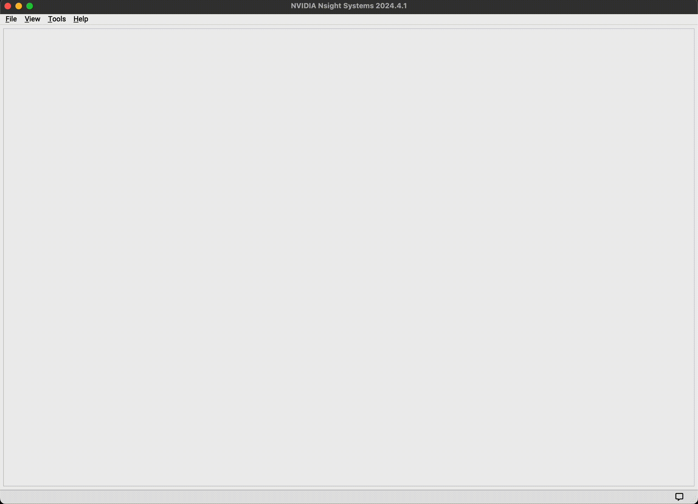
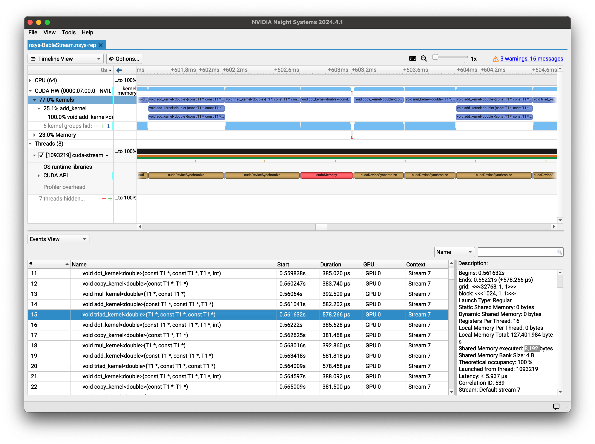
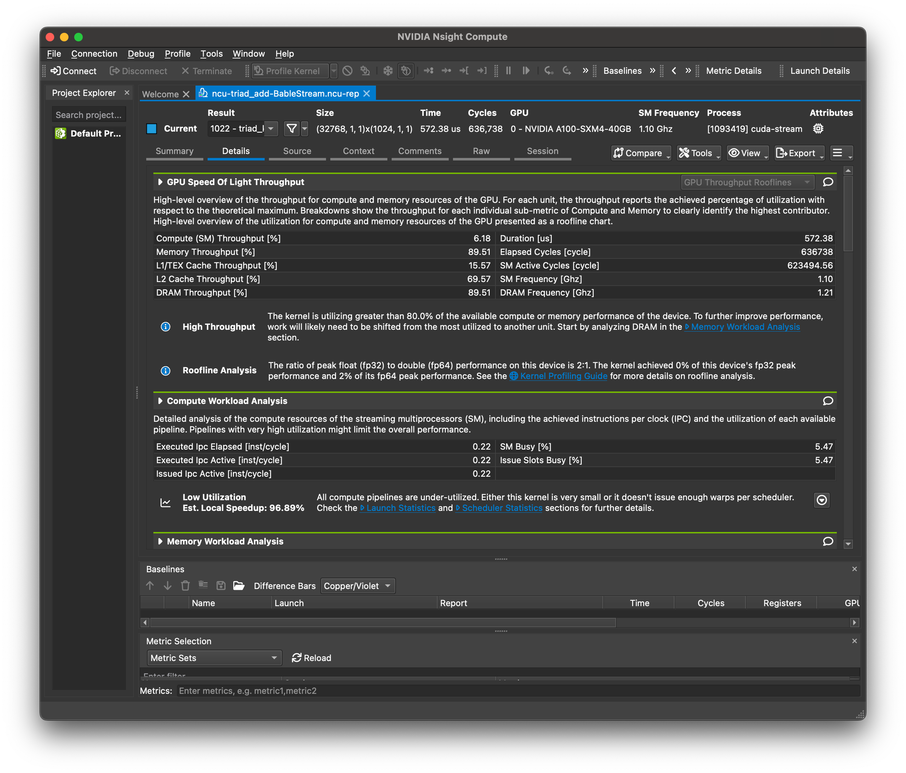
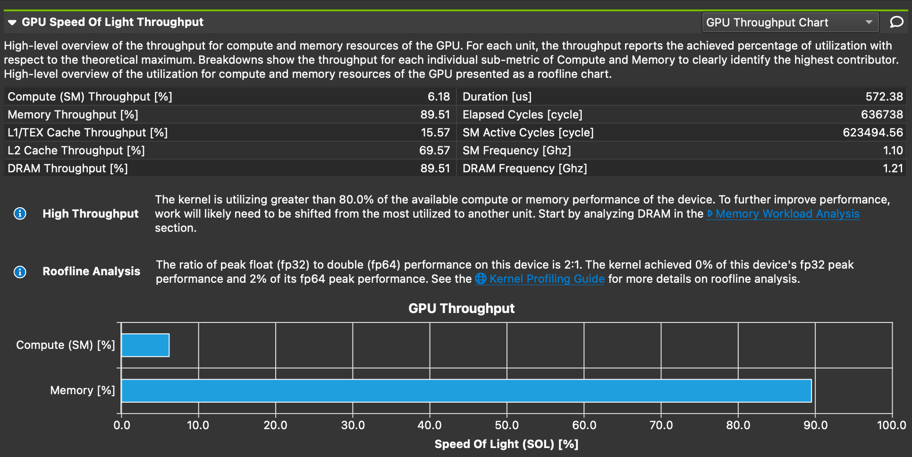
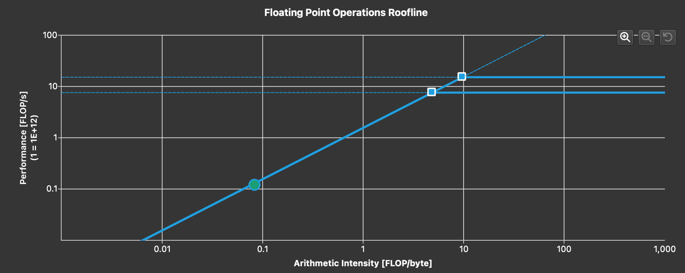
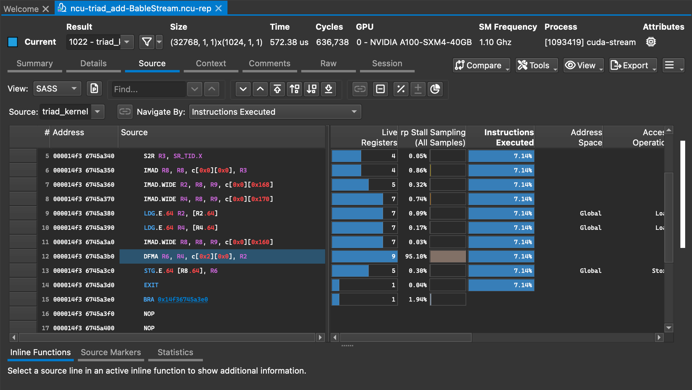

# Profiling with NVIDIA Nsight tools

NVIDIA® Nsight™ Systems provides developers a system-wide visualization of an applications performance. Developers can optimize bottlenecks to scale efficiently across any number or size of CPUs and GPUs on Polaris. For further optimizations to compute kernels developers should use Nsight Compute.

The NVIDIA Nsight Compute is an interactive kernel profiler for CUDA applications. It provides detailed performance metrics and API debugging via a user interface and command line tool.

In addition, the baseline feature of this tool allows users to compare results within the tool. NVIDIA Nsight Compute provides a customizable and data-driven user interface, metric collection, and can be extended with analysis scripts for post-processing results.


## Step-by-step guide

### Common part on Polaris
Build your application for Polaris, and then submit your job script to Polaris or start an interactive job mode on Polaris as follows:  
```
$ qsub -I -l select=1 -l walltime=1:00:00 -l filesystems=home:grand -q debug -A <project-name>

$ module load cudatoolkit-standalone/11.8.0 
$ module li

Currently Loaded Modules:
  1) craype-x86-rome          6) craype/2.7.15        11) cray-pals/1.1.7
  2) libfabric/1.11.0.4.125   7) cray-dsmml/0.2.2     12) cray-libpals/1.1.7
  3) craype-network-ofi       8) cray-mpich/8.1.16    13) PrgEnv-nvhpc/8.3.3
  4) perftools-base/22.05.0   9) cray-pmi/6.1.2       14) craype-accel-nvidia80
  5) nvhpc/21.9              10) cray-pmi-lib/6.0.17  15) cudatoolkit-standalone/11.8.0
 
$ nsys --version
NVIDIA Nsight Systems version 2022.4.2.1-df9881f

$ ncu --version
NVIDIA (R) Nsight Compute Command Line Profiler
Copyright (c) 2018-2022 NVIDIA Corporation
Version 2022.3.0.0 (build 31729285) (public-release)
```


### Nsight Systems
Run your application with Nsight Systems as follows:  
```
$ nsys profile -o {output_filename} --stats=true ./{your_application}
```

### Nsight Compute
Run your application with Nsight Compute.  
```
$ ncu --set detailed -k {kernel_name} -o {output_filename} ./{your_application}
```

Remark: Without -o option, Nsight Compute provides performance data as a standard output

### Post-processing the profiled data
#### Post-processing via CLI
```
$ nsys stats {output_filename}.qdrep
$ ncu -i {output_filename}.ncu-rep  
```

#### Post-processing on your local system via GUI
* Install [NVIDIA Nsight Systems](https://developer.nvidia.com/nsight-systems) and [NVIDIA Nsight Compute](https://developer.nvidia.com/nsight-compute) after downloading both of them from the  NVIDIA Developer Zone.   
Remark: Local client version should be the same as or newer than NVIDIA Nsight tools on Polaris. 
* Download nsys output files (i.e., ending with .qdrep and . sqlite) to your local system, and then open them with NVIDIA Nsight Systems on your local system.  
* Download ncu output files (i.e., ending with .ncu-rep) to your local system, and then open them with NVIDIA Nsight Compute on your local system.  

### More options for performance analysis with Nsight Systems and Nsight Compute
```
$ nsys --help
$ ncu --help
```

## A quick example

### Build an example


```
jkwack@polaris-login-04:~> qsub -I -l walltime=1:00:00 -l filesystems=home:grand -q debug -A Performance
qsub: waiting for job 443287.polaris-pbs-01.hsn.cm.polaris.alcf.anl.gov to start
qsub: job 443287.polaris-pbs-01.hsn.cm.polaris.alcf.anl.gov ready

jkwack@x3004c0s31b1n0:~> module load cudatoolkit-standalone/11.8.0  cmake/3.23.2 
----------------------------------------------------------------------------------
     cmake 3.23.2 successfully loaded
----------------------------------------------------------------------------------
jkwack@x3004c0s31b1n0:~> module li

Currently Loaded Modules:
  1) craype-x86-rome          5) nvhpc/21.9          9) cray-pmi/6.1.2       13) PrgEnv-nvhpc/8.3.3
  2) libfabric/1.11.0.4.125   6) craype/2.7.15      10) cray-pmi-lib/6.0.17  14) craype-accel-nvidia80
  3) craype-network-ofi       7) cray-dsmml/0.2.2   11) cray-pals/1.1.7      15) cudatoolkit-standalone/11.8.0
  4) perftools-base/22.05.0   8) cray-mpich/8.1.16  12) cray-libpals/1.1.7   16) cmake/3.23.2

jkwack@x3004c0s31b1n0:~> cd ALCFBeginnersGuide/polaris/examples/BabelStream/

jkwack@x3004c0s31b1n0:~/ALCFBeginnersGuide/polaris/examples/BabelStream> cmake -Bbuild_polaris -H. -DMODEL=cuda -DCMAKE_CUDA_COMPILER=nvcc -DCUDA_ARCH=sm_80 -DCXX_EXTRA_FLAGS="-DDEBUG"
-- The CXX compiler identification is NVHPC 21.9.0
-- Detecting CXX compiler ABI info
-- Detecting CXX compiler ABI info - done
-- Check for working CXX compiler: /opt/nvidia/hpc_sdk/Linux_x86_64/21.9/compilers/bin/nvc++ - skipped
-- Detecting CXX compile features
-- Detecting CXX compile features - done
-- CXX_EXTRA_LINK_FLAGS: 
        Appends to link flags which appear *before* the objects.
        Do not use this for linking libraries, as the link line is order-dependent
-- CXX_EXTRA_LIBRARIES: 
        Append to link flags which appear *after* the objects.
        Use this for linking extra libraries (e.g `-lmylib`, or simply `mylib`)
-- CXX_EXTRA_LINKER_FLAGS: 
        Append to linker flags (i.e GCC's `-Wl` or equivalent)
-- Available models:  omp;ocl;std-data;std-indices;std-ranges;hip;cuda;kokkos;sycl;sycl2020;acc;raja;tbb;thrust
-- Selected model  :  cuda
-- Supported flags:

   CMAKE_CXX_COMPILER (optional, default=c++): Any CXX compiler that is supported by CMake detection, this is used for host compilation
   MEM (optional, default=DEFAULT): Device memory mode:
        DEFAULT   - allocate host and device memory pointers.
        MANAGED   - use CUDA Managed Memory.
        PAGEFAULT - shared memory, only host pointers allocated.
   CMAKE_CUDA_COMPILER (required): Path to the CUDA nvcc compiler
   CUDA_ARCH (required): Nvidia architecture, will be passed in via `-arch=` (e.g `sm_70`) for nvcc
   CUDA_EXTRA_FLAGS (optional, default=): Additional CUDA flags passed to nvcc, this is appended after `CUDA_ARCH`

-- Model-specific flags for this build:

   CMAKE_CXX_COMPILER = `/opt/nvidia/hpc_sdk/Linux_x86_64/21.9/compilers/bin/nvc++`
   MEM = `DEFAULT`
   CMAKE_CUDA_COMPILER = `nvcc`
   CUDA_ARCH = `sm_80`
   CUDA_EXTRA_FLAGS = ``

-- The CUDA compiler identification is NVIDIA 11.8.89
-- Detecting CUDA compiler ABI info
-- Detecting CUDA compiler ABI info - done
-- Check for working CUDA compiler: /soft/compilers/cudatoolkit/cuda-11.8.0/bin/nvcc - skipped
-- Detecting CUDA compile features
-- Detecting CUDA compile features - done
-- NVCC flags: -forward-unknown-to-host-compiler -arch=sm_80  -DNDEBUG
-- Default Release flags are `-O3;-march=native`, set RELEASE_FLAGS to override (CXX_EXTRA_* flags are not affected)
-- CXX vendor  : NVHPC (/opt/nvidia/hpc_sdk/Linux_x86_64/21.9/compilers/bin/nvc++)
-- Platform    : x86_64
-- Sources     : src/cuda/CUDAStream.cu
-- Libraries   : 
-- CXX Flags   : -fast  -DNDEBUG -O3;-march=native -DDEBUG
    CXX flags derived from (CMake + (Override ? Override : Default) + Extras), where:
        CMake                    = `-fast  -DNDEBUG`
        Default                  = `-O3;-march=native`
        Override (RELEASE_FLAGS) = ``
        Extras (CXX_EXTRA_FLAGS) = `-DDEBUG`
-- Link Flags  :  -DDEBUG
-- Linker Flags:   
-- Defs        : CUDA;MEM=DEFAULT
-- Executable  : cuda-stream
-- Configuring done
-- Generating done
-- Build files have been written to: /home/jkwack/ALCFBeginnersGuide/polaris/examples/BabelStream/build_polaris

jkwack@x3004c0s31b1n0:~/ALCFBeginnersGuide/polaris/examples/BabelStream> cmake --build build_polaris
[ 33%] Building CUDA object CMakeFiles/cuda-stream.dir/src/cuda/CUDAStream.cu.o
[ 66%] Building CXX object CMakeFiles/cuda-stream.dir/src/main.cpp.o
[100%] Linking CXX executable cuda-stream
[100%] Built target cuda-stream

jkwack@x3004c0s31b1n0:~/ALCFBeginnersGuide/polaris/examples/BabelStream> cd build_polaris

jkwack@x3004c0s31b1n0:~/ALCFBeginnersGuide/polaris/examples/BabelStream/build_polaris> ./cuda-stream 
BabelStream
Version: 4.0
Implementation: CUDA
Running kernels 100 times
Precision: double
Array size: 268.4 MB (=0.3 GB)
Total size: 805.3 MB (=0.8 GB)
Using CUDA device NVIDIA A100-SXM4-40GB
Driver: 11040
Function    MBytes/sec  Min (sec)   Max         Average     
Copy        1394571.325 0.00038     0.00039     0.00039     
Mul         1356858.489 0.00040     0.00040     0.00040     
Add         1369610.580 0.00059     0.00059     0.00059     
Triad       1377425.601 0.00058     0.00059     0.00059     
Dot         1210774.906 0.00044     0.00046     0.00045     


```

### Nsight Systems


#### Running a stream benchmark with Nsight Systems
```
jkwack@x3004c0s31b1n0:~/ALCFBeginnersGuide/polaris/examples/BabelStream/build_polaris> nsys profile -o nsys-BableStream --stats=true ./cuda-stream
BabelStream
Version: 4.0
Implementation: CUDA
Running kernels 100 times
Precision: double
Array size: 268.4 MB (=0.3 GB)
Total size: 805.3 MB (=0.8 GB)
Using CUDA device NVIDIA A100-SXM4-40GB
Driver: 11040
Function    MBytes/sec  Min (sec)   Max         Average     
Copy        1380773.347 0.00039     0.00040     0.00039     
Mul         1339057.277 0.00040     0.00041     0.00040     
Add         1357947.578 0.00059     0.00060     0.00059     
Triad       1366674.928 0.00059     0.00061     0.00059     
Dot         1221315.862 0.00044     0.00047     0.00046     
Generating '/var/tmp/pbs.443287.polaris-pbs-01.hsn.cm.polaris.alcf.anl.gov/nsys-report-0f92.qdstrm'
[1/8] [========================100%] nsys-BableStream.nsys-rep
[2/8] [========================100%] nsys-BableStream.sqlite
[3/8] Executing 'nvtxsum' stats report
SKIPPED: /home/jkwack/ALCFBeginnersGuide/polaris/examples/BabelStream/build_polaris/nsys-BableStream.sqlite does not contain NV Tools Extension (NVTX) data.
[4/8] Executing 'osrtsum' stats report

 Time (%)  Total Time (ns)  Num Calls    Avg (ns)     Med (ns)    Min (ns)   Max (ns)    StdDev (ns)        Name     
 --------  ---------------  ---------  ------------  -----------  --------  -----------  ------------  --------------
     85.4      600,324,911         20  30,016,245.6  2,954,740.5     1,874  100,153,187  42,448,177.7  poll          
     13.9       97,981,690      1,201      81,583.4     32,832.0     1,001   12,135,694     409,614.9  ioctl         
      0.2        1,576,358         79      19,953.9     16,831.0     3,777      582,252      64,452.5  mmap64        
      0.1          933,197         12      77,766.4     44,122.5    15,760      477,445     127,146.2  sem_timedwait 
      0.1          908,730         51      17,818.2      2,304.0     1,242      750,938     104,774.6  fopen         
      0.1          591,044        120       4,925.4      4,534.0     1,713       26,640       2,557.2  open64        
      0.1          556,242          4     139,060.5    134,597.0    73,047      214,001      73,033.8  pthread_create
      0.0          116,960         18       6,497.8      5,911.0     1,553       21,280       4,925.1  mmap          
      0.0           67,907         11       6,173.4      2,265.0     1,282       27,632       7,883.2  munmap        
      0.0           35,577          1      35,577.0     35,577.0    35,577       35,577           0.0  fgets         
      0.0           32,451          6       5,408.5      5,250.0     2,585        8,426       2,375.3  open          
      0.0           26,230         13       2,017.7      1,964.0     1,393        3,427         531.1  write         
      0.0           21,180          3       7,060.0      6,042.0     5,691        9,447       2,074.6  putc          
      0.0           19,846         13       1,526.6      1,473.0     1,012        2,615         511.0  read          
      0.0           18,107          9       2,011.9      1,403.0     1,022        7,124       1,928.2  fclose        
      0.0           11,230          2       5,615.0      5,615.0     3,646        7,584       2,784.6  socket        
      0.0           10,299          1      10,299.0     10,299.0    10,299       10,299           0.0  connect       
      0.0            9,528          2       4,764.0      4,764.0     3,016        6,512       2,472.0  fread         
      0.0            8,526          2       4,263.0      4,263.0     1,032        7,494       4,569.3  fcntl         
      0.0            6,592          1       6,592.0      6,592.0     6,592        6,592           0.0  pipe2         
      0.0            6,552          2       3,276.0      3,276.0     2,405        4,147       1,231.8  fwrite        
      0.0            1,142          1       1,142.0      1,142.0     1,142        1,142           0.0  bind          

[5/8] Executing 'cudaapisum' stats report

 Time (%)  Total Time (ns)  Num Calls    Avg (ns)    Med (ns)   Min (ns)   Max (ns)    StdDev (ns)           Name         
 --------  ---------------  ---------  ------------  ---------  --------  -----------  ------------  ---------------------
     42.4      197,136,841        401     491,613.1  529,743.0   384,591      601,517      97,227.2  cudaDeviceSynchronize
     34.1      158,470,102          4  39,617,525.5  312,771.5   150,142  157,694,417  78,717,966.1  cudaMalloc           
     22.9      106,782,867        103   1,036,726.9  453,751.0   434,905   20,583,003   3,384,488.9  cudaMemcpy           
      0.4        1,754,850        501       3,502.7    3,347.0     3,095       30,477       1,382.9  cudaLaunchKernel     
      0.2        1,162,069          4     290,517.3  301,670.5   130,415      428,313     122,296.4  cudaFree             

[6/8] Executing 'gpukernsum' stats report

 Time (%)  Total Time (ns)  Instances  Avg (ns)   Med (ns)   Min (ns)  Max (ns)  StdDev (ns)      GridXYZ         BlockXYZ                                Name                           
 --------  ---------------  ---------  ---------  ---------  --------  --------  -----------  ---------------  --------------  ----------------------------------------------------------
     24.5       58,455,846        100  584,558.5  584,109.0   583,165   595,325      2,238.9  32768    1    1  1024    1    1  void add_kernel<double>(const T1 *, const T1 *, T1 *)     
     24.4       58,140,939        100  581,409.4  580,765.0   579,741   596,508      2,992.7  32768    1    1  1024    1    1  void triad_kernel<double>(T1 *, const T1 *, const T1 *)   
     18.3       43,518,576        100  435,185.8  435,581.5   420,702   446,877      3,654.1   256    1    1   1024    1    1  void dot_kernel<double>(const T1 *, const T1 *, T1 *, int)
     16.5       39,387,367        100  393,873.7  393,854.5   391,583   395,454        682.9  32768    1    1  1024    1    1  void mul_kernel<double>(T1 *, const T1 *)                 
     16.1       38,370,919        100  383,709.2  383,646.0   379,486   396,862      1,629.7  32768    1    1  1024    1    1  void copy_kernel<double>(const T1 *, T1 *)                
      0.2          523,101          1  523,101.0  523,101.0   523,101   523,101          0.0  32768    1    1  1024    1    1  void init_kernel<double>(T1 *, T1 *, T1 *, T1, T1, T1)    

[7/8] Executing 'gpumemtimesum' stats report

 Time (%)  Total Time (ns)  Count  Avg (ns)   Med (ns)  Min (ns)   Max (ns)   StdDev (ns)      Operation     
 --------  ---------------  -----  ---------  --------  --------  ----------  -----------  ------------------
    100.0       61,381,882    103  595,940.6   2,401.0     2,048  20,467,582  3,443,386.5  [CUDA memcpy DtoH]

[8/8] Executing 'gpumemsizesum' stats report

 Total (MB)  Count  Avg (MB)  Med (MB)  Min (MB)  Max (MB)  StdDev (MB)      Operation     
 ----------  -----  --------  --------  --------  --------  -----------  ------------------
    805.511    103     7.820     0.002     0.002   268.435       45.361  [CUDA memcpy DtoH]

Generated:
    /home/jkwack/ALCFBeginnersGuide/polaris/examples/BabelStream/build_polaris/nsys-BableStream.nsys-rep
    /home/jkwack/ALCFBeginnersGuide/polaris/examples/BabelStream/build_polaris/nsys-BableStream.sqlite
```

#### Reviewing the Nsight Systems data via GUI




### Nsight Compute
#### Running a stream benchmark with Nsight Compute for triad_kernel
```
jkwack@x3004c0s31b1n0:~/ALCFBeginnersGuide/polaris/examples/BabelStream/build_polaris> ncu --set detailed -k regex:"triad|add" -o ncu-triad_add-BableStream ./cuda-stream
BabelStream
Version: 4.0
Implementation: CUDA
Running kernels 100 times
Precision: double
Array size: 268.4 MB (=0.3 GB)
Total size: 805.3 MB (=0.8 GB)
==PROF== Connected to process 47488 (/home/jkwack/ALCFBeginnersGuide/polaris/examples/BabelStream/build_polaris/cuda-stream)
Using CUDA device NVIDIA A100-SXM4-40GB
Driver: 11040
==PROF== Profiling "add_kernel": 0%....50%....100% - 18 passes
==PROF== Profiling "triad_kernel": 0%....50%....100% - 18 passes
==PROF== Profiling "add_kernel": 0%....50%....100% - 18 passes
==PROF== Profiling "triad_kernel": 0%....50%....100% - 18 passes
==PROF== Profiling "add_kernel": 0%....50%....100% - 18 passes
==PROF== Profiling "triad_kernel": 0%....50%....100% - 18 passes
==PROF== Profiling "add_kernel": 0%....50%....100% - 18 passes
==PROF== Profiling "triad_kernel": 0%....50%....100% - 18 passes
==PROF== Profiling "add_kernel": 0%....50%....100% - 18 passes
==PROF== Profiling "triad_kernel": 0%....50%....100% - 18 passes
==PROF== Profiling "add_kernel": 0%....50%....100% - 18 passes
==PROF== Profiling "triad_kernel": 0%....50%....100% - 18 passes
==PROF== Profiling "add_kernel": 0%....50%....100% - 18 passes
==PROF== Profiling "triad_kernel": 0%....50%....100% - 18 passes
==PROF== Profiling "add_kernel": 0%....50%....100% - 18 passes
==PROF== Profiling "triad_kernel": 0%....50%....100% - 18 passes
==PROF== Profiling "add_kernel": 0%....50%....100% - 18 passes
==PROF== Profiling "triad_kernel": 0%....50%....100% - 18 passes
==PROF== Profiling "add_kernel": 0%....50%....100% - 18 passes
==PROF== Profiling "triad_kernel": 0%....50%....100% - 18 passes
==PROF== Profiling "add_kernel": 0%....50%....100% - 18 passes
==PROF== Profiling "triad_kernel": 0%....50%....100% - 18 passes
==PROF== Profiling "add_kernel": 0%....50%....100% - 18 passes
==PROF== Profiling "triad_kernel": 0%....50%....100% - 18 passes
==PROF== Profiling "add_kernel": 0%....50%....100% - 18 passes
==PROF== Profiling "triad_kernel": 0%....50%....100% - 18 passes
==PROF== Profiling "add_kernel": 0%....50%....100% - 18 passes
==PROF== Profiling "triad_kernel": 0%....50%....100% - 18 passes
==PROF== Profiling "add_kernel": 0%....50%....100% - 18 passes
==PROF== Profiling "triad_kernel": 0%....50%....100% - 18 passes
==PROF== Profiling "add_kernel": 0%....50%....100% - 18 passes
==PROF== Profiling "triad_kernel": 0%....50%....100% - 18 passes
==PROF== Profiling "add_kernel": 0%....50%....100% - 18 passes
==PROF== Profiling "triad_kernel": 0%....50%....100% - 18 passes
==PROF== Profiling "add_kernel": 0%....50%....100% - 18 passes
==PROF== Profiling "triad_kernel": 0%....50%....100% - 18 passes
==PROF== Profiling "add_kernel": 0%....50%....100% - 18 passes
==PROF== Profiling "triad_kernel": 0%....50%....100% - 18 passes
==PROF== Profiling "add_kernel": 0%....50%....100% - 18 passes
==PROF== Profiling "triad_kernel": 0%....50%....100% - 18 passes
==PROF== Profiling "add_kernel": 0%....50%....100% - 18 passes
==PROF== Profiling "triad_kernel": 0%....50%....100% - 18 passes
==PROF== Profiling "add_kernel": 0%....50%....100% - 18 passes
==PROF== Profiling "triad_kernel": 0%....50%....100% - 18 passes
==PROF== Profiling "add_kernel": 0%....50%....100% - 18 passes
==PROF== Profiling "triad_kernel": 0%....50%....100% - 18 passes
==PROF== Profiling "add_kernel": 0%....50%....100% - 18 passes
==PROF== Profiling "triad_kernel": 0%....50%....100% - 18 passes
==PROF== Profiling "add_kernel": 0%....50%....100% - 18 passes
==PROF== Profiling "triad_kernel": 0%....50%....100% - 18 passes
==PROF== Profiling "add_kernel": 0%....50%....100% - 18 passes
==PROF== Profiling "triad_kernel": 0%....50%....100% - 18 passes
==PROF== Profiling "add_kernel": 0%....50%....100% - 18 passes
==PROF== Profiling "triad_kernel": 0%....50%....100% - 18 passes
==PROF== Profiling "add_kernel": 0%....50%....100% - 18 passes
==PROF== Profiling "triad_kernel": 0%....50%....100% - 18 passes
==PROF== Profiling "add_kernel": 0%....50%....100% - 18 passes
==PROF== Profiling "triad_kernel": 0%....50%....100% - 18 passes
==PROF== Profiling "add_kernel": 0%....50%....100% - 18 passes
==PROF== Profiling "triad_kernel": 0%....50%....100% - 18 passes
==PROF== Profiling "add_kernel": 0%....50%....100% - 18 passes
==PROF== Profiling "triad_kernel": 0%....50%....100% - 18 passes
==PROF== Profiling "add_kernel": 0%....50%....100% - 18 passes
==PROF== Profiling "triad_kernel": 0%....50%....100% - 18 passes
==PROF== Profiling "add_kernel": 0%....50%....100% - 18 passes
==PROF== Profiling "triad_kernel": 0%....50%....100% - 18 passes
==PROF== Profiling "add_kernel": 0%....50%....100% - 18 passes
==PROF== Profiling "triad_kernel": 0%....50%....100% - 18 passes
==PROF== Profiling "add_kernel": 0%....50%....100% - 18 passes
==PROF== Profiling "triad_kernel": 0%....50%....100% - 18 passes
==PROF== Profiling "add_kernel": 0%....50%....100% - 18 passes
==PROF== Profiling "triad_kernel": 0%....50%....100% - 18 passes
==PROF== Profiling "add_kernel": 0%....50%....100% - 18 passes
==PROF== Profiling "triad_kernel": 0%....50%....100% - 18 passes
==PROF== Profiling "add_kernel": 0%....50%....100% - 18 passes
==PROF== Profiling "triad_kernel": 0%....50%....100% - 18 passes
==PROF== Profiling "add_kernel": 0%....50%....100% - 18 passes
==PROF== Profiling "triad_kernel": 0%....50%....100% - 18 passes
==PROF== Profiling "add_kernel": 0%....50%....100% - 18 passes
==PROF== Profiling "triad_kernel": 0%....50%....100% - 18 passes
==PROF== Profiling "add_kernel": 0%....50%....100% - 18 passes
==PROF== Profiling "triad_kernel": 0%....50%....100% - 18 passes
==PROF== Profiling "add_kernel": 0%....50%....100% - 18 passes
==PROF== Profiling "triad_kernel": 0%....50%....100% - 18 passes
==PROF== Profiling "add_kernel": 0%....50%....100% - 18 passes
==PROF== Profiling "triad_kernel": 0%....50%....100% - 18 passes
==PROF== Profiling "add_kernel": 0%....50%....100% - 18 passes
==PROF== Profiling "triad_kernel": 0%....50%....100% - 18 passes
==PROF== Profiling "add_kernel": 0%....50%....100% - 18 passes
==PROF== Profiling "triad_kernel": 0%....50%....100% - 18 passes
==PROF== Profiling "add_kernel": 0%....50%....100% - 18 passes
==PROF== Profiling "triad_kernel": 0%....50%....100% - 18 passes
==PROF== Profiling "add_kernel": 0%....50%....100% - 18 passes
==PROF== Profiling "triad_kernel": 0%....50%....100% - 18 passes
==PROF== Profiling "add_kernel": 0%....50%....100% - 18 passes
==PROF== Profiling "triad_kernel": 0%....50%....100% - 18 passes
==PROF== Profiling "add_kernel": 0%....50%....100% - 18 passes
==PROF== Profiling "triad_kernel": 0%....50%....100% - 18 passes
==PROF== Profiling "add_kernel": 0%....50%....100% - 18 passes
==PROF== Profiling "triad_kernel": 0%....50%....100% - 18 passes
==PROF== Profiling "add_kernel": 0%....50%....100% - 18 passes
==PROF== Profiling "triad_kernel": 0%....50%....100% - 18 passes
==PROF== Profiling "add_kernel": 0%....50%....100% - 18 passes
==PROF== Profiling "triad_kernel": 0%....50%....100% - 18 passes
==PROF== Profiling "add_kernel": 0%....50%....100% - 18 passes
==PROF== Profiling "triad_kernel": 0%....50%....100% - 18 passes
==PROF== Profiling "add_kernel": 0%....50%....100% - 18 passes
==PROF== Profiling "triad_kernel": 0%....50%....100% - 18 passes
==PROF== Profiling "add_kernel": 0%....50%....100% - 18 passes
==PROF== Profiling "triad_kernel": 0%....50%....100% - 18 passes
==PROF== Profiling "add_kernel": 0%....50%....100% - 18 passes
==PROF== Profiling "triad_kernel": 0%....50%....100% - 18 passes
==PROF== Profiling "add_kernel": 0%....50%....100% - 18 passes
==PROF== Profiling "triad_kernel": 0%....50%....100% - 18 passes
==PROF== Profiling "add_kernel": 0%....50%....100% - 18 passes
==PROF== Profiling "triad_kernel": 0%....50%....100% - 18 passes
==PROF== Profiling "add_kernel": 0%....50%....100% - 18 passes
==PROF== Profiling "triad_kernel": 0%....50%....100% - 18 passes
==PROF== Profiling "add_kernel": 0%....50%....100% - 18 passes
==PROF== Profiling "triad_kernel": 0%....50%....100% - 18 passes
==PROF== Profiling "add_kernel": 0%....50%....100% - 18 passes
==PROF== Profiling "triad_kernel": 0%....50%....100% - 18 passes
==PROF== Profiling "add_kernel": 0%....50%....100% - 18 passes
==PROF== Profiling "triad_kernel": 0%....50%....100% - 18 passes
==PROF== Profiling "add_kernel": 0%....50%....100% - 18 passes
==PROF== Profiling "triad_kernel": 0%....50%....100% - 18 passes
==PROF== Profiling "add_kernel": 0%....50%....100% - 18 passes
==PROF== Profiling "triad_kernel": 0%....50%....100% - 18 passes
==PROF== Profiling "add_kernel": 0%....50%....100% - 18 passes
==PROF== Profiling "triad_kernel": 0%....50%....100% - 18 passes
==PROF== Profiling "add_kernel": 0%....50%....100% - 18 passes
==PROF== Profiling "triad_kernel": 0%....50%....100% - 18 passes
==PROF== Profiling "add_kernel": 0%....50%....100% - 18 passes
==PROF== Profiling "triad_kernel": 0%....50%....100% - 18 passes
==PROF== Profiling "add_kernel": 0%....50%....100% - 18 passes
==PROF== Profiling "triad_kernel": 0%....50%....100% - 18 passes
==PROF== Profiling "add_kernel": 0%....50%....100% - 18 passes
==PROF== Profiling "triad_kernel": 0%....50%....100% - 18 passes
==PROF== Profiling "add_kernel": 0%....50%....100% - 18 passes
==PROF== Profiling "triad_kernel": 0%....50%....100% - 18 passes
==PROF== Profiling "add_kernel": 0%....50%....100% - 18 passes
==PROF== Profiling "triad_kernel": 0%....50%....100% - 18 passes
==PROF== Profiling "add_kernel": 0%....50%....100% - 18 passes
==PROF== Profiling "triad_kernel": 0%....50%....100% - 18 passes
==PROF== Profiling "add_kernel": 0%....50%....100% - 18 passes
==PROF== Profiling "triad_kernel": 0%....50%....100% - 18 passes
==PROF== Profiling "add_kernel": 0%....50%....100% - 18 passes
==PROF== Profiling "triad_kernel": 0%....50%....100% - 18 passes
==PROF== Profiling "add_kernel": 0%....50%....100% - 18 passes
==PROF== Profiling "triad_kernel": 0%....50%....100% - 18 passes
==PROF== Profiling "add_kernel": 0%....50%....100% - 18 passes
==PROF== Profiling "triad_kernel": 0%....50%....100% - 18 passes
==PROF== Profiling "add_kernel": 0%....50%....100% - 18 passes
==PROF== Profiling "triad_kernel": 0%....50%....100% - 18 passes
==PROF== Profiling "add_kernel": 0%....50%....100% - 18 passes
==PROF== Profiling "triad_kernel": 0%....50%....100% - 18 passes
==PROF== Profiling "add_kernel": 0%....50%....100% - 18 passes
==PROF== Profiling "triad_kernel": 0%....50%....100% - 18 passes
==PROF== Profiling "add_kernel": 0%....50%....100% - 18 passes
==PROF== Profiling "triad_kernel": 0%....50%....100% - 18 passes
==PROF== Profiling "add_kernel": 0%....50%....100% - 18 passes
==PROF== Profiling "triad_kernel": 0%....50%....100% - 18 passes
==PROF== Profiling "add_kernel": 0%....50%....100% - 18 passes
==PROF== Profiling "triad_kernel": 0%....50%....100% - 18 passes
==PROF== Profiling "add_kernel": 0%....50%....100% - 18 passes
==PROF== Profiling "triad_kernel": 0%....50%....100% - 18 passes
==PROF== Profiling "add_kernel": 0%....50%....100% - 18 passes
==PROF== Profiling "triad_kernel": 0%....50%....100% - 18 passes
==PROF== Profiling "add_kernel": 0%....50%....100% - 18 passes
==PROF== Profiling "triad_kernel": 0%....50%....100% - 18 passes
==PROF== Profiling "add_kernel": 0%....50%....100% - 18 passes
==PROF== Profiling "triad_kernel": 0%....50%....100% - 18 passes
==PROF== Profiling "add_kernel": 0%....50%....100% - 18 passes
==PROF== Profiling "triad_kernel": 0%....50%....100% - 18 passes
==PROF== Profiling "add_kernel": 0%....50%....100% - 18 passes
==PROF== Profiling "triad_kernel": 0%....50%....100% - 18 passes
==PROF== Profiling "add_kernel": 0%....50%....100% - 18 passes
==PROF== Profiling "triad_kernel": 0%....50%....100% - 18 passes
==PROF== Profiling "add_kernel": 0%....50%....100% - 18 passes
==PROF== Profiling "triad_kernel": 0%....50%....100% - 18 passes
==PROF== Profiling "add_kernel": 0%....50%....100% - 18 passes
==PROF== Profiling "triad_kernel": 0%....50%....100% - 18 passes
==PROF== Profiling "add_kernel": 0%....50%....100% - 18 passes
==PROF== Profiling "triad_kernel": 0%....50%....100% - 18 passes
==PROF== Profiling "add_kernel": 0%....50%....100% - 18 passes
==PROF== Profiling "triad_kernel": 0%....50%....100% - 18 passes
==PROF== Profiling "add_kernel": 0%....50%....100% - 18 passes
==PROF== Profiling "triad_kernel": 0%....50%....100% - 18 passes
==PROF== Profiling "add_kernel": 0%....50%....100% - 18 passes
==PROF== Profiling "triad_kernel": 0%....50%....100% - 18 passes
==PROF== Profiling "add_kernel": 0%....50%....100% - 18 passes
==PROF== Profiling "triad_kernel": 0%....50%....100% - 18 passes
==PROF== Profiling "add_kernel": 0%....50%....100% - 18 passes
==PROF== Profiling "triad_kernel": 0%....50%....100% - 18 passes
==PROF== Profiling "add_kernel": 0%....50%....100% - 18 passes
==PROF== Profiling "triad_kernel": 0%....50%....100% - 18 passes
==PROF== Profiling "add_kernel": 0%....50%....100% - 18 passes
==PROF== Profiling "triad_kernel": 0%....50%....100% - 18 passes
==PROF== Profiling "add_kernel": 0%....50%....100% - 18 passes
==PROF== Profiling "triad_kernel": 0%....50%....100% - 18 passes
Function    MBytes/sec  Min (sec)   Max         Average     
Copy        1327610.078 0.00040     0.00049     0.00041     
Mul         1298750.316 0.00041     0.00042     0.00042     
Add         2835.967    0.28396     0.29772     0.28652     
Triad       2835.097    0.28405     0.28949     0.28621     
Dot         844053.045  0.00064     0.00073     0.00068     
==PROF== Disconnected from process 47488
==PROF== Report: /home/jkwack/ALCFBeginnersGuide/polaris/examples/BabelStream/build_polaris/ncu-triad_add-BableStream.ncu-rep
```

#### Reviewing the Nsight Compute data via GUI







## References  
[NVIDIA Nsight Systems Documentation](https://docs.nvidia.com/nsight-systems/UserGuide/index.html)  
[NVIDIA Nsight Compute Documentation](https://docs.nvidia.com/nsight-compute/NsightCompute/index.html)
