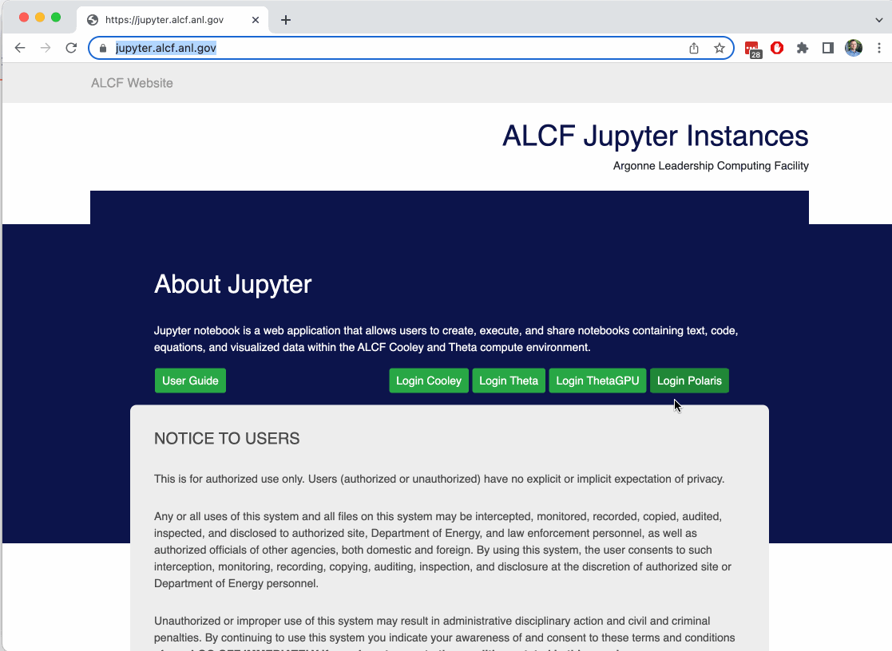

# Jupyter at ALCF

### Users are assumed to know:
* basic Jupyter Notebook usage
* basic batch scheduler usage on a cluster/supercomputer
### Learning Goals:
* Login to ALCF Jupyter no Polaris
* Submit a job via the Jupyter interface
* Adding a Conda environment to your Jupyter kernel list


JupyterHub is an open-source application to allow multiple users to launch Jupyter Notebooks from a central location. 

[Link to Full Docs](https://docs.alcf.anl.gov/services/jupyter-hub/)

### Quick Description of the Process:
1. At ALCF, users can use the JupyterHub instances at [https://jupyter.alcf.anl.gov](https://jupyter.alcf.anl.gov).
2. Select which machine on which to launch a notebook server.
3. Login using your [Passcode Token](https://docs.alcf.anl.gov/account-project-management/accounts-and-access/alcf-passcode-tokens/), exactly the same as you would to login to an ALCF machine via ssh.
3. Select parameters for the job that will be submitted to the queue. You are defining the parameters for `qstat` at this stage.
    * Select a job profile: This field lists the current available Profiles "Polaris Compute Node", etc.
    * Queue Name: This field provides a list of available queues on the system
    * Project List: This field displays the list of active projects associated with the user on the given system
    * Number Chunks: This field allows the user to select the number of compute nodes to be allocated for the job
    * Runtime (minutes:seconds): This field allows the user to set the runtime of the job in minutes and seconds.
    * File Systems: This field allows the user to select which file systems are required.
4. Wait for the job to start. There is a 5 minute timeout set, after which the service removes your job from the queue, and you must resubmit. We are working on improving this behavior.
5. When your server starts, navigate to your working folder, then start a new notebook using a kernel.

### Visual of the process:



## Customize Environment

ALCF provides a simple Python3 environment, and our default `conda` module as well. The later is most likely what everyone should use, as the Python3 environment has nothing installed. Users can add kernels that employ their environment to meet their needs. See [03_pythonEnvs](./03_pythonEnvs.md) for how to make custom environments.

With your custom environment loaded, you can run the command below with properly titled `<kernel-display-name>` and `<kernel-name>` to generate a new kernel configuration in the path `~/.local/share/jupyter/kernels/<kernel-name>/`. The configuration file is named `kernel.json`.

From a terminal run:
```Shell
# Run with environment setup for your target Python Kernel
python3 -m ipykernel install \
    --user \
    --name=<kernel-name> \
    --display-name=<kernel-display-name> \
    --env PATH "${PATH}" \
    --env LD_LIBRARY_PATH "${LD_LIBRARY_PATH}" \
    --env MPICH_GPU_SUPPORT_ENABLED "${MPICH_GPU_SUPPORT_ENABLED}" \
    --env CONDA_PREFIX "${CONDA_PREFIX}"
```

This will create a `kernel.json` file in `~/.local/share/jupyter/kernels/<kernel-name>/`. Here is an example for the default `conda` environment:

```json
{
 "argv": [
  "/soft/applications/conda/2024-04-29/mconda3/bin/python3",
  "-Xfrozen_modules=off",
  "-m",
  "ipykernel_launcher",
  "-f",
  "{connection_file}"
 ],
 "display_name": "mycondatest",
 "language": "python",
 "metadata": {
  "debugger": true
 },
 "env": {
  "PATH": "/soft/applications/conda/2024-04-29/mconda3/bin:/soft/applications/conda/2024-04-29/mconda3/condabin:/soft/compilers/cudatoolkit/cuda-12.4.1/bin:/soft/libraries/nccl/nccl_2.21.5-1+cuda12.4_x86_64/include:/opt/cray/pe/hdf5-parallel/1.12.2.9/bin:/opt/cray/pe/hdf5/1.12.2.9/bin:/opt/cray/pals/1.3.4/bin:/opt/cray/pe/mpich/8.1.28/ofi/gnu/12.3/bin:/opt/cray/pe/mpich/8.1.28/bin:/opt/cray/pe/craype/2.7.30/bin:/home/parton/.vscode-server/cli/servers/Stable-ea1445cc7016315d0f5728f8e8b12a45dc0a7286/server/bin/remote-cli:/soft/perftools/darshan/darshan-3.4.4/bin:/opt/cray/pe/perftools/23.12.0/bin:/opt/cray/pe/papi/7.0.1.2/bin:/opt/cray/libfabric/1.15.2.0/bin:/opt/clmgr/sbin:/opt/clmgr/bin:/opt/sgi/sbin:/opt/sgi/bin:/home/parton/.local/bin:/usr/local/bin:/usr/bin:/bin:/opt/c3/bin:/dbhome/db2cat/sqllib/bin:/dbhome/db2cat/sqllib/adm:/dbhome/db2cat/sqllib/misc:/dbhome/db2cat/sqllib/gskit/bin:/usr/lib/mit/bin:/usr/lib/mit/sbin:/opt/pbs/bin:/sbin:/opt/cray/pe/bin",
  "LD_LIBRARY_PATH": "/soft/compilers/cudatoolkit/cuda-12.4.1/extras/CUPTI/lib64:/soft/compilers/cudatoolkit/cuda-12.4.1/lib64:/soft/libraries/trt/TensorRT-8.6.1.6.Linux.x86_64-gnu.cuda-12.0/lib:/soft/libraries/nccl/nccl_2.21.5-1+cuda12.4_x86_64/lib:/soft/libraries/cudnn/cudnn-cuda12-linux-x64-v9.1.0.70/lib:/soft/perftools/darshan/darshan-3.4.4/lib:/opt/cray/pe/papi/7.0.1.2/lib64:/opt/cray/libfabric/1.15.2.0/lib64:/dbhome/db2cat/sqllib/lib64:/dbhome/db2cat/sqllib/lib64/gskit:/dbhome/db2cat/sqllib/lib32",
  "MPICH_GPU_SUPPORT_ENABLED": "1",
  "CONDA_PREFIX": "/soft/applications/conda/2024-04-29/mconda3"
 }
```

after completing these steps, you should see `<kernel-name>` kernel when you click new on the Jupyter Hub home page or when you use Kernel menu in a Jupyter notebook. Note: kernels are loaded by Jupyter during server start, not while the server is running. A stop/restart will be required if the kernel was installed while the server is running.

## Accessing Project Folders

From within the JupyterHub file browser, users are limited to viewing files within their home directory.

To access project directories located outside of your `$HOME`, a symbolic link to the directory must be created.

Explicitly, if a user wants to access project `ABC`, we can create a symbolic link in the terminal or via Juptyer:


```Shell
# from terminal
cd ~
ln -s /lus/eagle/projects/ABC ABC_project
```

```Shell
# in notebook using `!` escape
!ln -s /lus/eagle/projects/ABC ABC_project
```


