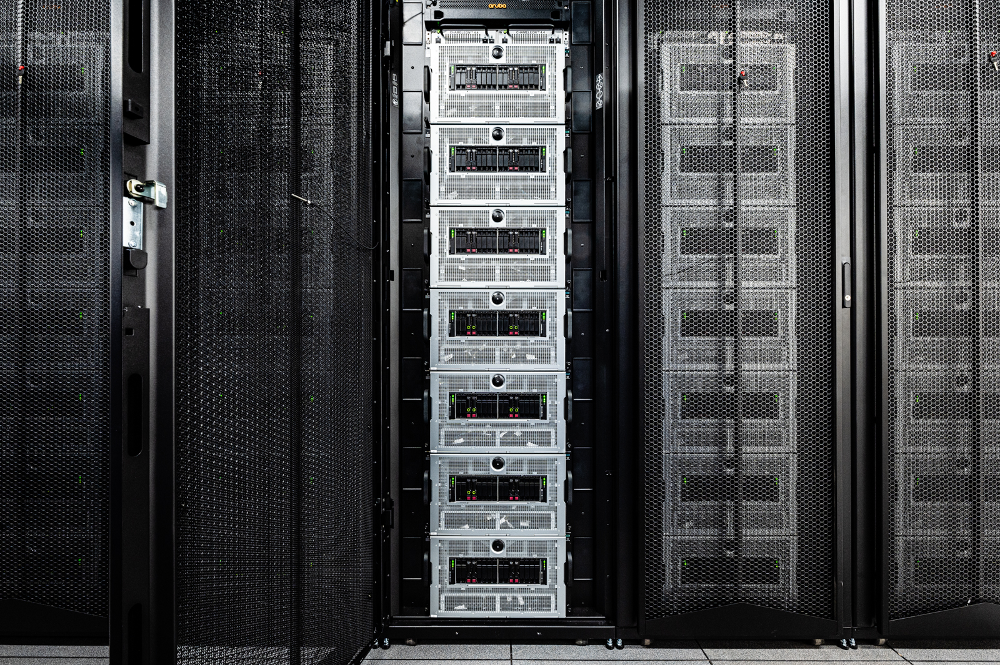
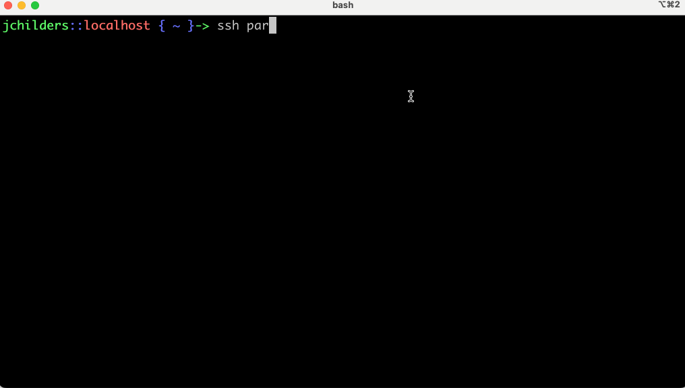
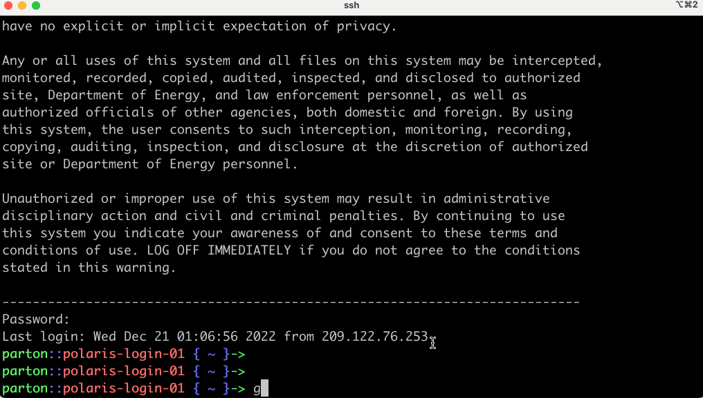
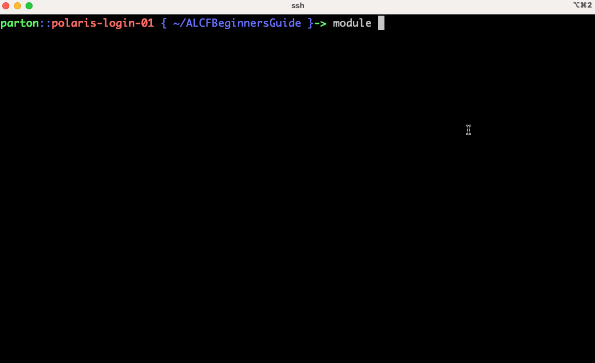

# Polaris Beginners Guide

This guide aims to introduce researchers with coding experience on clusters and/or supercomputers to the specifics of using ALCF systems.

### Users of this guide are assumed to know:
* basic linux terminal usage
* basic cluster scheduling
* basic code compilation
### Learning Goals:
* Use `module` command to inspect and modify the shell environment


## [Polaris](https://www.alcf.anl.gov/polaris)


The inside of Polaris again shows the _nodes_ stacked up in a closet.



Polaris is an NVIDIA A100-based system.

Polaris Machine Specs
* Speed: 44 petaflops
* Each Node has:
  * 4 NVIDIA (A100) GPUs
  * 1 AMD EPYC (Milan) CPUs
* ~560 Total Nodes


## Logging in:

Login using `ssh` replacing `<username>` with your ALCF username
```bash
ssh <username>@polaris.alcf.anl.gov
```



You will be prompted for your password, which is a six digit code generated uniquely each time using the MobilePASS+ app. 

## Quick filesystem breakdown

When you login, you start in your _home_ directory: `/home/<username>/` (1TB default starting quota)
As an ALCF user you will be assigned access to different allocation _projects_. You can see your projects listed on the [ALCF Accounts Page](accounts.alcf.anl.gov). Each project maps to a user group to control filesystem access, so you can also check your projects using the `groups` command on the terminal. Projects are given storage spaces on our Eagle and/or eagle Lustre filesystems where all members of the project can read/write and share data/software:
* `/lus/eagle/projects/<project-name>`
* `/lus/eagle/projects/<project-name>`
Users should use project spaces for large scale storage and software installations. Increases can be requested via `support@alcf.anl.gov`.

## Clone repo:

Next, clone this repository into your home directory using:
```bash
git clone https://github.com/argonne-lcf/ALCFBeginnersGuide.git
cd ALCFBeginnersGuide
```



## Getting to know the environment

ALCF uses [Environment Modules](https://modules.readthedocs.io/en/latest/index.html) to provide users with loadable software packages. This includes compilers, python installations, and other software. Here are some basic commands:

```bash
# list currently loaded modules
module list
# list all available modules
module avail
# list all available modules including the string "gcc"
module avail gcc
# show information about a module and lists commands that alter environment
module show gcc/11.2.0
# load a module
module load gcc/11.2.0
# unload a module (not always supported, like with Conda enviroments after activate is called)
module unload gcc/11.2.0
```



## [NEXT ->](00_scheduler.md)

