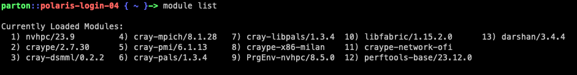
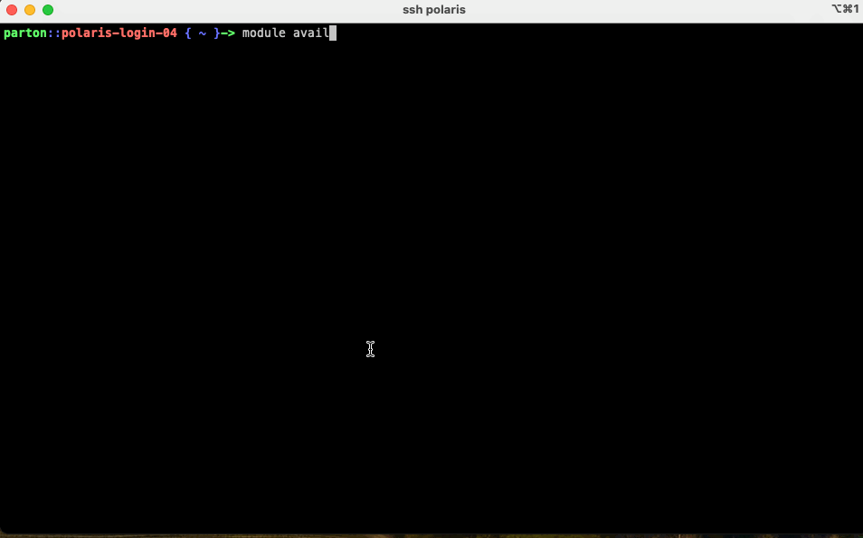
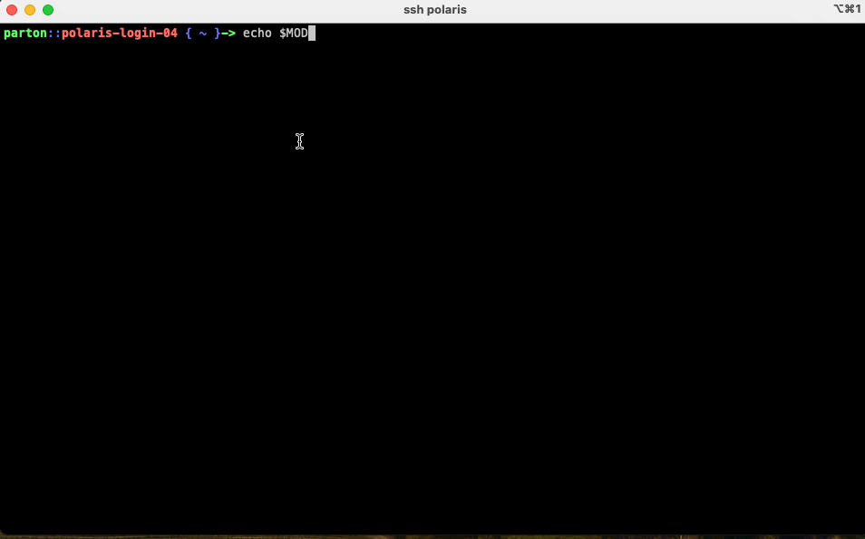
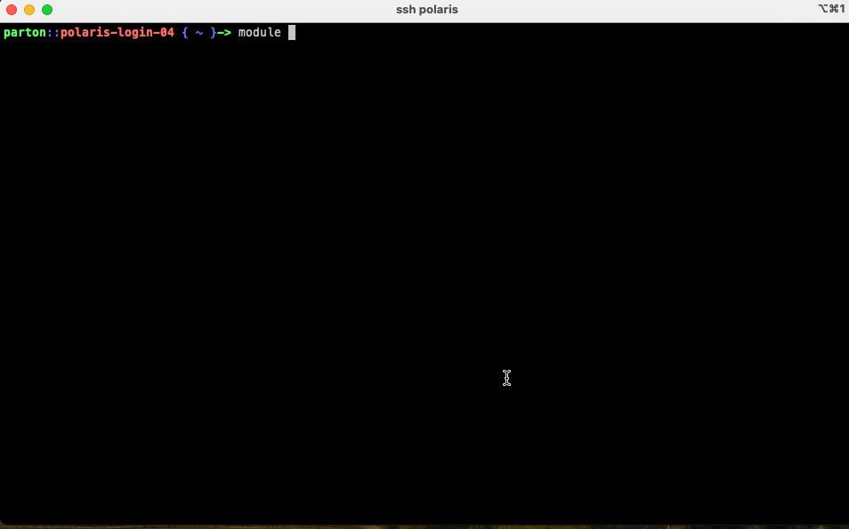

# Polaris Beginners Guide

This guide aims to introduce researchers with coding experience on clusters and/or supercomputers to the specifics of using ALCF systems.

### Users of this guide are assumed to know:
* basic linux terminal usage
* basic cluster scheduling
* basic code compilation
### Learning Goals:
* Use `module` command to inspect and modify the shell environment


## [Polaris](https://www.alcf.anl.gov/polaris)


The inside of Polaris again shows the _nodes_ stacked up in a closet.


Polaris is an NVIDIA A100-based system.

Polaris Machine Specs
* Speed: 44 petaflops
* Each Node has:
  * 4 NVIDIA (A100) GPUs
  * 1 AMD EPYC (Milan) CPUs
* ~560 Total Nodes


## Logging in:

Login using `ssh` replacing `<username>` with your ALCF username
```bash
ssh <username>@polaris.alcf.anl.gov
```


You will be prompted for your password, which is a six digit code generated uniquely each time using the MobilePASS+ app. 

## Quick filesystem breakdown

When you login, you start in your _home_ directory: `/home/<username>/` (100GB quota)
As an ALCF user you will be assigned access to different allocation _projects_. You can see your projects listed on the [ALCF Accounts Page](accounts.alcf.anl.gov). Each project maps to a user group to control filesystem access, so you can also check your projects using the `groups` command on the terminal. Projects are given storage spaces on our Eagle and/or Grand Lustre filesystems where all members of the project can read/write and share data/software:
* `/eagle/<project-name>`
* `/grand/<project-name>`
Users should use project spaces for large scale storage and software installations. Increases can be requested via `support@alcf.anl.gov`.

## Clone repo:

Next, clone this repository into your home directory using:
```bash
git clone https://github.com/argonne-lcf/ALCFBeginnersGuide.git
cd ALCFBeginnersGuide
```


## Getting to know the environment

ALCF uses [Environment Modules](https://modules.readthedocs.io/en/latest/index.html) to provide users with loadable software packages. This includes compilers, python installations, and other software. Here are some basic commands:

`module list`: lists all currently loaded modules


`module avail`: lists the available modules that can be loaded. What modules are available is controled by the `MODULEPATH` environment variable. The colon-seperated list of paths are scanned for module files. When you first login, this only contains system modules from HPE/Cray/etc. If the list is too long for your screen, you can use `less`-like commands to navigate (arrow keys, space bar, etc.).



By default, `MODULEPATH` only includes system libraries from HPE/Nvidia. One can include pre-built modules from ALCF staff by adding the path `/soft/modulefiles` to `MODULEFILE` using either of these commands:
```bash
export MODULEPATH=$MODULEPATH:/soft/modulefiles
# OR
module use /soft/modulefiles
```

After doing this, you will find additional modules listed.


## Loading modules

Now we can "load modules" which simply executes some simple bash commands to add paths to prebuilt software into our environment variables such as `PATH` and `LD_LIBRARY_PATH`, thus making the software easily available for compilation or use.

```bash
module load cudatoolkit-standalone/12.5.0
```

When one first logs in to Polaris, the Nvidia HPC environment is loaded. A more traditional GNU HPC environment is also available and can be loaded by swapping:
```bash
module swap PrgEnv-nvhpc PrgEnv-gnu
```


## Using Spack
Spack is an HPC oriented build management system. [Documentation can be found here.](https://spack.readthedocs.io/en/latest/) In this case of this quick introduction, Spack is simply used to offer additional pre-compiled software.

After loading one of the spack packages from the `/soft/modulefiles` area:
```bash 
module load spack-pe-gnu
```
There will be many new packages available to load via `modules` which can be perused via `module avail`.




## [NEXT ->](00_scheduler.md)

