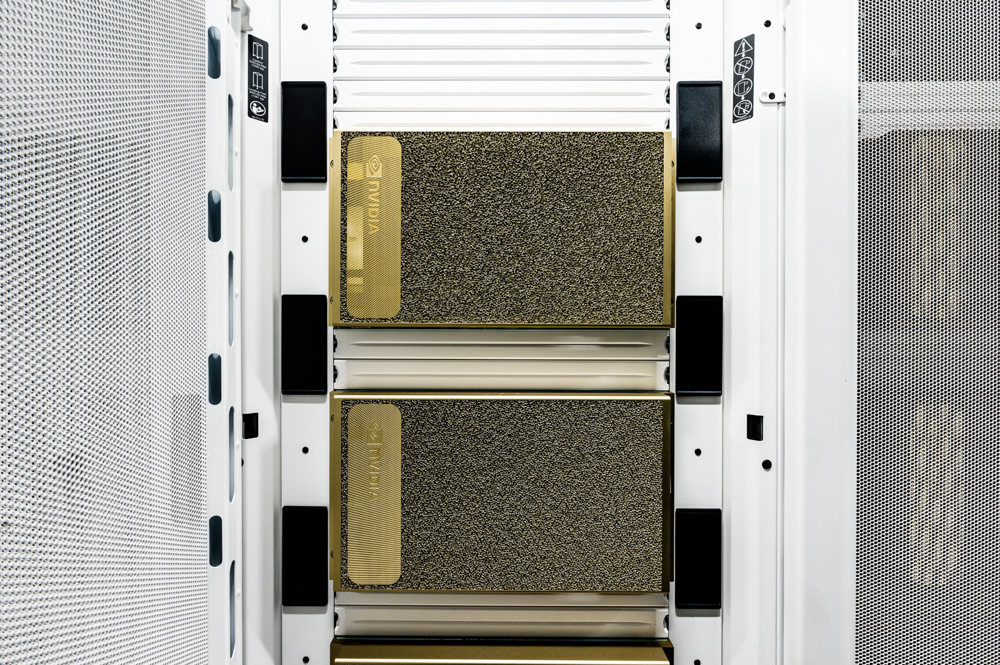

## [Theta](https://www.alcf.anl.gov/alcf-resources/theta)

The decals are stickers attached to the front of the computer _racks_ (closet sized). If you look inside a single closet you will see rows of computer _nodes_. Notice that there are repetitive rows inside the racks. These machines are made for _nodes_ to be replaced if needed.

Theta is an 11.7-petaflops supercomputer based on Intel processors and interconnect technology, an advanced memory architecture, and a Lustre-based parallel file system, all integrated by Cray’s HPC software stack.

Theta Machine Specs
* Speed: 11.7 petaflops
* Each Node has:
  * one 64-core Intel Xeon Phi (7230) CPU running at 1.3-GHz
  * 192GB of DDR4 memory
  * 16GB of high-bandwidth memory
* 4,392 Total nodes installed in 24 Racks
* High-speed Network Tech: Aries network with Dragonfly topology

## [ThetaGPU](https://www.alcf.anl.gov/alcf-resources/theta)

Inside ThetaGPU, you'll also see repetition, though NVidia placed these fancy plates over the hardware so you only see their logo. However, each plate covers 1 computer _node_.

 ThetaGPU Racks | ThetaGPU Inside
 --- | ---
 | 

ThetaGPU is an NVIDIA DGX A100-based system. The DGX A100 comprises eight NVIDIA A100 GPUs that provide a total of 320 gigabytes of memory for training AI datasets, as well as high-speed NVIDIA Mellanox ConnectX-6 network interfaces.

ThetaGPU Machine Specs
* Speed: 3.9 petaflops
* Each Node has:
  * 8 NVIDIA (A100) GPUs each with 40GB onboard memory
  * 2 AMD EPYC (7742) CPUs
  * 1 TB DDR4 Memory
* 24 Total Nodes installed in 7 Racks

